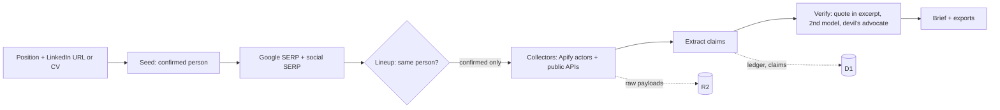

# Radar: report for the jury

Team **Old Boys** (Josef Buryan, Minas Arustamyan, Robert Vojacek). From Dusk Till Dawn Hackathon #01, Prague, Case 01 "Social media deep research" (Apify). Live: **https://oldboys.asajj.cz**. Repo snapshot at code freeze, Fri 2026-10-09 07:14.

## 1. Pitch

Radar is a research assistant for recruiters and hiring managers. You give it a position and a candidate (a LinkedIn link or a CV). In about 2 to 4 minutes it returns a brief built from public sources: what the candidate has done, what backs each must-have of the position, what does not match, and what to ask at the interview. The rule is **"it researches, it never judges"**. Every line of the brief links to its source. A line is a FACT only when its quote is found word for word in the saved source text. Everything else is an INFERENCE or an open question. The recruiter makes the decision, not the tool.

## 2. Try it in 3 minutes

| Step | What to do |
|---|---|
| 1. Look without an account | Open https://oldboys.asajj.cz. The landing page has a sample brief and an interactive evidence example. Both show a **fictional** candidate and are marked as such. |
| 2. Get in | **Create account** (`/register`). Any e-mail address works. For the company, tick **"Company outside the Czech Republic (no IČO)"**, or leave the IČO empty and type the name by hand. An ARES lookup is optional. Limit: 10 sign-ups per hour per IP. |
| 3. Pick a position | **New brief** (`/briefs/new`): choose a title from the role catalog (183 roles with must-haves), or open **Positions → Add a position from a posting** and paste a job-ad link (StartupJobs, Jobs.cz incl. company career sites, Greenhouse, Lever, Ashby, any page with JobPosting data). You can also type a position by hand. |
| 4. Add a candidate | One row per person: a public LinkedIn profile URL, a pasted CV, or a PDF / text CV file. Then click **Research N candidates**. |
| 5. Read the brief | The position's results table shows the progress. Open the brief when the status is done (usually 2 to 4 minutes). |
| 6. See how we test it | `/validation` (public, linked in the footer): eval results, and what is real, simulated or unfinished. |

Limits you may hit: 6 started runs per hour per company and 20 runs per hour across the whole site (`src/domain/run-status.ts`). Each run spends real Apify and Anthropic credit.

**Browser extension** (`extension/`, WXT, Chrome / Edge / Firefox): it adds a "Research" button on LinkedIn `/in/*` pages and a right-click "Research with oldboys" item on selected text. To build it, run `pnpm --filter oldboys-extension build`, then in `chrome://extensions` choose Load unpacked → `extension/.output/chrome-mv3`. It starts runs through `POST /api/runs` with the team's run token, which we do not publish; ask the team for a demo. See [`extension/README.md`](extension/README.md).

## 3. The recruiter journey

1. **Positions.** A position comes from a job-ad link (one model call extracts the must-haves), from the role catalog (no model call), or is typed by hand (`/positions`, `/positions/new`).
2. **Candidates arrive.** The channels are:
   - e-mail to `jobs+<tag>@asajj.cz`
   - the hosted apply page `/apply/<tag>`, which accepts a CV upload
   - the StartupJobs webhook
   - a form API for Google Forms
   - manual add (LinkedIn URL, pasted CV, CV file)
   - the browser extension

   Incoming applications sit in a pool per position (the position page) until the recruiter starts research.
3. **Research run.** One declared recipe runs 28 steps (searches, profiles, code, registries, model steps). A given LinkedIn profile or CV is the confirmed person. Other same-name profiles stay "possibly the same person" and are not used. When nothing is confirmed, the run pauses with "Quick question: is this … profile also …?" (at most 3 questions). The **identity map** shows which profiles are linked to the candidate and which belong to someone else (hidden on phones).
4. **The brief** (`/runs/<id>`):
   - **"In 30 seconds"** summary: confirmed, missing, ask, check.
   - Sections ordered by confidence, each badged *Strong / Some / Thin evidence*. Facts and inferences are listed apart.
   - **Show evidence** on every line: the verbatim quote, "Open at the quote" (a text-fragment link), the retrieval date, and the saved text around the quote with the match highlighted.
   - **CV vs public record** on CV runs: "Matches public record" / "Differs, ask, don't assume" / "Not found publicly".
   - **Devil's advocate**: a second check tries to break each confirmed must-have (about someone else, a fork, a course exercise, outdated). What fails moves to "To verify".
   - **Profile signals** (deterministic sentences about the confirmed accounts).
   - **Role fit scorecard**: the share of must-haves with public evidence, with every plus and minus listed under it, each with its evidence and its effect on the figure; open points (risks, CV differences, registry records, account signals) carry "no effect on fit" and a question. Never a score of the person.
   - **Confidence in this brief**: how far to trust the brief, measured on the brief: the share of its findings that are verified facts (with a facts / inferences / said-in-a-call bar and sources by origin), the identity line (confirmed / open / none, with the reasons) and one row per check made (registries, CV, accounts, gaps) with what each leaves open. The brief forbids a trustworthiness score of a person; this card never computes one (plans/014).
   - **Code contributions** from a deep GitHub scrape, for engineering and data roles only.
   - **Public registries** (Czech, name search).
   - The **EN | CZ** switch translates the brief; quotes stay in the original language.
5. **Before the interview:**
   - **Copy interview kit** or download it as `.md`.
   - **Add interview to calendar (.ics)** (RFC 5545).
   - **Copy for ATS** (plain text to paste by hand).
   - **Copy reference questions**.
   - **Candidate notice** in English or Czech.
   - An optional **AI verification call** (ElevenLabs + Twilio). The recruiter must tick "The candidate agreed to this call and to the recording." What the candidate says is stored as a STATEMENT, never as a FACT.

   All exports follow the EN | CZ switch.
6. **After the interview.** Under **"After the interview: paste the filled kit"** you paste the kit back and see what was answered and which points are still open. It runs in the browser only; nothing is saved and the notes are never read.
7. **Retention:**
   - **Delete candidate data** at once when the candidate is rejected or asks for it, with a reason.
   - A nightly purge deletes every run older than 7 days, including intake applications and CV files.
   - An **audit record** (`/runs/<id>/audit`) shows who started the run, the purpose, the legal basis as declared by the hiring team, the services that processed data, and the deletion date.
   - A **GDPR Art. 15 export** (`GET /api/runs/<id>/access-export`).

## 4. How it works

- **Platform:** Next.js 16 on Cloudflare Workers via OpenNext. The research runs as a Cloudflare Workflow (`ResearchRunWorkflow`, one durable step per recipe step, `waitForEvent` for the lineup pause). Cloudflare D1 holds the runs, claims and ledger. R2 holds the raw payloads. Plan: [`plans/002-cloudflare-platform/`](plans/002-cloudflare-platform/00-SYNTHESIS.md).
- **Planner:** a declared recipe per goal ([`src/recipe/goals/hiring.ts`](src/recipe/goals/hiring.ts); a company due-diligence recipe exists for the API and the extension). There is no free-running agent loop. Branching happens only through `onEmpty` (a reasoned gap or a fallback step) and the lineup pause. Plan: [`plans/001-deep-research-arch/`](plans/001-deep-research-arch/00-SYNTHESIS.md).
- **Collectors:** 22 are registered in [`src/recipe/sources/index.ts`](src/recipe/sources/index.ts).
  - **Apify actors (12):** `apify/google-search-scraper`, `harvestapi/linkedin-profile-scraper` with the `apimaestro/linkedin-profile-detail` fallback, `harvestapi/linkedin-profile-posts`, `harvestapi/linkedin-company`, `apidojo/tweet-scraper`, `apify/instagram-profile-scraper`, `clockworks/tiktok-profile-scraper`, `streamers/youtube-scraper`, `apify/facebook-pages-scraper`, `apify/website-content-crawler`, `saswave/github-profile-scraper`.
  - **Public REST APIs (10):** GitHub, GitHub deep (contributor statistics), Stack Exchange, Hugging Face, ORCID, OpenAlex, Bluesky, Czech registries (ISIR, ARES, or.justice.cz, Police, plus professional chambers by role), ARES search and ARES public register (both for due diligence).
- **Model seams.** Primary model `claude-opus-5-5`, verify model `claude-sonnet-5-5` ([`wrangler.jsonc`](wrangler.jsonc)):

  | Seam | Model |
  |---|---|
  | Role questions | primary |
  | Seed (profile or CV → identity) | primary |
  | Identity resolve | primary |
  | Extract | primary |
  | Verify residue (after the deterministic quote check) | verify |
  | Devil's advocate | verify |
  | Art. 9 flag | verify |
  | Synthesize | primary |
  | Enriched profile | primary |
  | Czech translation | verify |
  | Position extraction | primary |
  | Call transcript ingest | primary |
- **Budget:** the runner enforces it, never the model. Each run gets $0.50 and 18 paid actor runs for collectors. When the budget is used up, the remaining collectors are skipped with "run budget reached" (`src/recipe/runner.ts`, `src/workflow/research-run.ts`).
- **Ledger:** `ledger_entries` is append-only (`seq` per run). Every step, model call and cost is a row. The UI streams it over SSE.
- **Calls:** ElevenLabs agent + Twilio, dialled once on operator approval, never from a Workflow step. With `CALL_PROVIDER=mock`, calls are labelled MOCK. Plan: [`plans/005-call-verification/`](plans/005-call-verification/00-SYNTHESIS.md).

## 5. Mapping to the judging criteria

Weights from the case brief ([`docs/brief.md`](docs/brief.md)).

| Criterion | Weight | What we built | Evidence |
|---|---|---|---|
| Value and track relevance | 35 | A recruiter flow from position to interview to deletion. The brief answers the position's must-haves, not a generic summary. Exports go into the tools a recruiter already uses (ATS paste, calendar, kit). | `/briefs/new`, `/runs/<id>`, [`plans/012-brief-flow/`](plans/012-brief-flow/00-SYNTHESIS.md), commits `0b1e9ed` (ATS), `177df41` (.ics), `629f5a9` (kit review) |
| Originality | 25 | Positions come first: catalog or job-ad link → must-haves → research per must-have. Identity is settled before anything reaches the model. A devil's advocate may only weaken findings. CV vs public record. An AI phone call with consent whose answers stay STATEMENTs. Czech registries by role. | `src/domain/role-catalog/`, `src/recipe/seams/challenge.ts`, `src/app/runs/[id]/cv-check.ts`, `src/domain/call-ingest.ts`, `src/domain/cz-registry.ts`; commits `f903bf1`, `236d2ba`, `e36e4aa` |
| Working end-to-end | 20 | Live on production: sign-up → position → candidate → run → brief → exports → delete. Six intake channels. A degraded path when the AI is down (evidence-only brief, labelled NO AI). | https://oldboys.asajj.cz, live runs in [`docs/ops/llm-manual-runs.md`](docs/ops/llm-manual-runs.md), `src/workflow/intake-email.ts`, `src/app/apply/` |
| Technical execution | 10 | Durable Workflow with a pause, append-only ledger, budget in the runner, deterministic quote check before any model verify, Zod contracts, strict TypeScript + ESLint, 1,873 + 21 tests, an eval that `pnpm check` guards. | `src/recipe/runner.ts`, `src/recipe/seams/verify.ts`, `migrations/0001_init.sql`, `pnpm check` |
| Validation and honest limitations | 10 | An eval set with ground truth and traps, scored in two modes. A public `/validation` page generated from the eval results. Simulated parts carry a pill in the app. Known misses and issues are listed (section 8). | [`eval/RESULTS.md`](eval/RESULTS.md), `/validation`, [`src/app/validation/page.tsx`](src/app/validation/page.tsx), [`eval/reviews/`](eval/reviews/) |

## 6. Numbers

| What | Value | Source |
|---|---|---|
| Tests | **1,873 app tests passed (2 skipped) + 21 extension tests**, all green | `pnpm check` at 03:35 |
| Eval | **84 of 95 checks, 0 unsafe misses, 11 conservative**, the same in strict mode; 0 lineup questions | [`eval/RESULTS.md`](eval/RESULTS.md) |
| Run time (16-source runs on Josef Buryan, a consenting team member) | 2 min 56 s to 4 min 35 s | runs a0ec24b1, c43ddbf4, d994339e, 597867c5 in [`docs/ops/llm-manual-runs.md`](docs/ops/llm-manual-runs.md) |
| Cost per run | $0.19 to $0.28 for those runs; $0.55 to $0.83 for full-profile runs (enriched profile, 20+ sources) | same file, from the ledger `cost_usd` |
| Position from a job-ad link | $0.011 to $0.027 per extraction | same file |
| Collectors | 22 (12 Apify actors, 10 public REST APIs) | `src/recipe/sources/index.ts` |
| Role catalog | 183 roles in 10 families | `src/domain/role-catalog/` |
| Commits / contributors | 270+ commits on `main` by 3 people, from 19:27 on 8 Oct | `git log` |
| Review loop | Product reviews by an AI reviewer: 2.3 → 3.1 → 3.6 → 3.8 → **4.1 / 5** over 5 iterations | [`eval/reviews/`](eval/reviews/) |

## 7. Guardrails and GDPR, as the code enforces them

- **Public sources only:**
  - The extension reads only the profile URL, the name and the location line.
  - The server never fetches linkedin.com itself; LinkedIn is read through Apify actors.
  - Facebook is read only through the public pages scraper.
- **Identity quarantine:** only sources of the confirmed person reach the AI extract and verify steps (`confirmedSources`, `src/recipe/seams/resolve.ts`). Name + city alone never merges a profile (`1eea712`).
- **FACT needs a verbatim quote inside a stored source excerpt** (`quoteSupported`, `src/recipe/seams/verify.ts`). Otherwise the claim is downgraded to INFERENCE. The second model and the devil's advocate can only downgrade.
- **GDPR Art. 9:** claims touching health, politics, religion, ethnicity or sexuality are **dropped, never masked**:
  - in the brief (`src/recipe/seams/synthesize.ts`, regex plus a model flag)
  - in the open state and in exports (`src/domain/art9.ts`)
- **Candidate notice** in English and Czech, with the deletion date. **Audit record** with who, why, the legal basis as declared, the services that processed data, and retention. **Art. 15 export** with confirmed data only: no namesakes, ledger, phone numbers or Art. 9 claims.
- **Deletion:**
  - **Delete on rejection** happens at once.
  - A **nightly purge** at 03:00 UTC removes everything after 7 days (R2 objects, CVs, sources, claims, candidates, gaps, briefs, calls, ledger, applications, webhook events, the run row) (`src/workflow/purge.ts`).
- **Open endpoints** return only what the brief shows:
  - `/state` lists only the brief's claims (no Art. 9) and excerpts from confirmed sources only (`5801b67`).
  - `/events` sends whitelisted, scrubbed process facts (`7e6977d`).

## 8. Honest limitations and what is simulated

**Simulated, and labelled in the app:**
- **MOCK** phone call (`CALL_PROVIDER=mock`). Production is set to live ElevenLabs.
- **CACHED** brief: a finished brief opened later is the stored copy.
- **NO AI** brief: evidence only, when the model is unavailable.
- The eval personas and their recorded model answers.
- The landing-page sample brief.
- ARES lookups at sign-up served from a stored copy.

**Not done:**
- There is no eval on real people with written ground truth. The eval uses five fictional personas with recorded search results and model answers, so it measures rules and wiring, not the live model's judgement. Its simulated recruiter is always right.
- Known eval misses: own GitHub profiles found only by name + city stay unused; a CV-only quote shows as "differs"; an overstated claim is downgraded whole.
- No ATS API write-back, by design. "Copy for ATS" and `.ics` are copy / download only.
- Facebook profiles are not opened. No reverse image search. LinkedIn needs a public `/in/` URL.
- OpenAlex and Stack Exchange need API keys, or the shared Worker IP gets rate-limited (429 / throttle).
- "Saved copy" in Show evidence is the stored text around the quote. The raw page in R2 is not served to the browser.

**Known issues as of 03:50 (Fri 2026-10-09), verified in the code:**
1. **A per-candidate "Fit" percentage** is shown in `/briefs` and in the position results table.
   - It is the weighted share of the role's must-haves that have public evidence (position must-haves weigh 2, catalog extras 1; has = 1, partial = 0.5), computed in code (`src/recipe/seams/profile.ts`).
   - It measures evidence coverage, not the person. But it is a number per candidate in a list of candidates, and it sits next to the footer line "never scores people" and the landing text "No scores, ever".
   - Its caption says "this position's must-haves", but it also counts the catalog extras.
2. **The "Working style" section** of the enriched profile shows DISC and MBTI types with a confidence level. They are inferred only from the person's own public writing and labelled "Inference from public writing, not an assessment of the person" (`src/app/runs/[id]/profile-sections.tsx`). This sits uneasily with the case's out-of-bounds list and with our own start-form line "we do not judge personality".
3. **The Czech registry step runs for every position**, by name only:
   - It searches the insolvency register, ARES, or.justice.cz persons and the Police wanted and missing persons list (`src/domain/cz-registry.ts`).
   - Hits are labelled "namesake possible" and the card says to confirm at the interview. Still, a namesake's record can appear on a candidate's brief.
4. **Art. 9 claims are filtered on output** but stay in the D1 `claims` table until the run is deleted or purged.
5. **Sending the candidate notice is not recorded.** The audit record says "Not recorded by this tool".
6. **Access control is thin:**
   - Run, audit and export pages open by their unguessable run UUID without login.
   - A run without a company (started by the API or the extension) can be deleted by any logged-in account.
   - The call-approve route does not check the call's company.
7. **The budget gates paid collectors only.** Model steps after the cap still run, so recorded run totals reach $0.83 against a $0.50 budget.

## 9. How we built it

Three people, each with several Claude Code agents running in parallel sessions on one monorepo. Everyone pushed to `main` without PRs and without force; CI deploys every push.
- [`PROGRESS.md`](PROGRESS.md) is the coordination log: every agent writes Started / Finished / Files.
- Decisions live in [`plans/`](plans/), with contracts in [`specs/`](specs/README.md).
- An AI "CEO review" graded screenshots and live runs, and fixes landed as `fix: review NNN` commits.
- Every manual or agent model run and its cost is logged in [`docs/ops/llm-manual-runs.md`](docs/ops/llm-manual-runs.md). In-app model calls are in the D1 ledger.

## 10. Links

- [`README.md`](README.md): what it does, the "Validation and honest limitations" section, quickstart, deploy
- [`docs/brief.md`](docs/brief.md): the case
- [`plans/001-deep-research-arch/00-SYNTHESIS.md`](plans/001-deep-research-arch/00-SYNTHESIS.md): architecture
- [`plans/006-profile-first/00-SYNTHESIS.md`](plans/006-profile-first/00-SYNTHESIS.md): profile-first start
- [`plans/008-intake-connectors/00-SYNTHESIS.md`](plans/008-intake-connectors/00-SYNTHESIS.md): intake
- [`plans/012-brief-flow/00-SYNTHESIS.md`](plans/012-brief-flow/00-SYNTHESIS.md): recruiter flow
- [`plans/012-fake-profile-signals/00-SYNTHESIS.md`](plans/012-fake-profile-signals/00-SYNTHESIS.md): profile signals
- [`plans/014-trust-box/00-SYNTHESIS.md`](plans/014-trust-box/00-SYNTHESIS.md): confidence in this brief (evidence, identity, checks; no trust score of a person)
- [`eval/RESULTS.md`](eval/RESULTS.md) and https://oldboys.asajj.cz/validation: validation
- [`docs/ops/call-verification.md`](docs/ops/call-verification.md), [`docs/ops/intake.md`](docs/ops/intake.md): runbooks
- [`CHANGELOG.md`](CHANGELOG.md): every user-visible change
