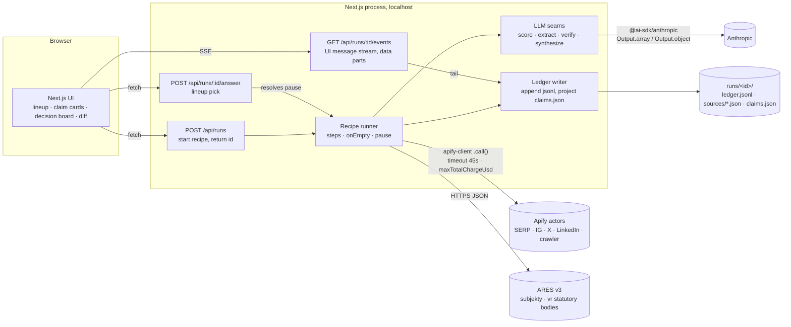
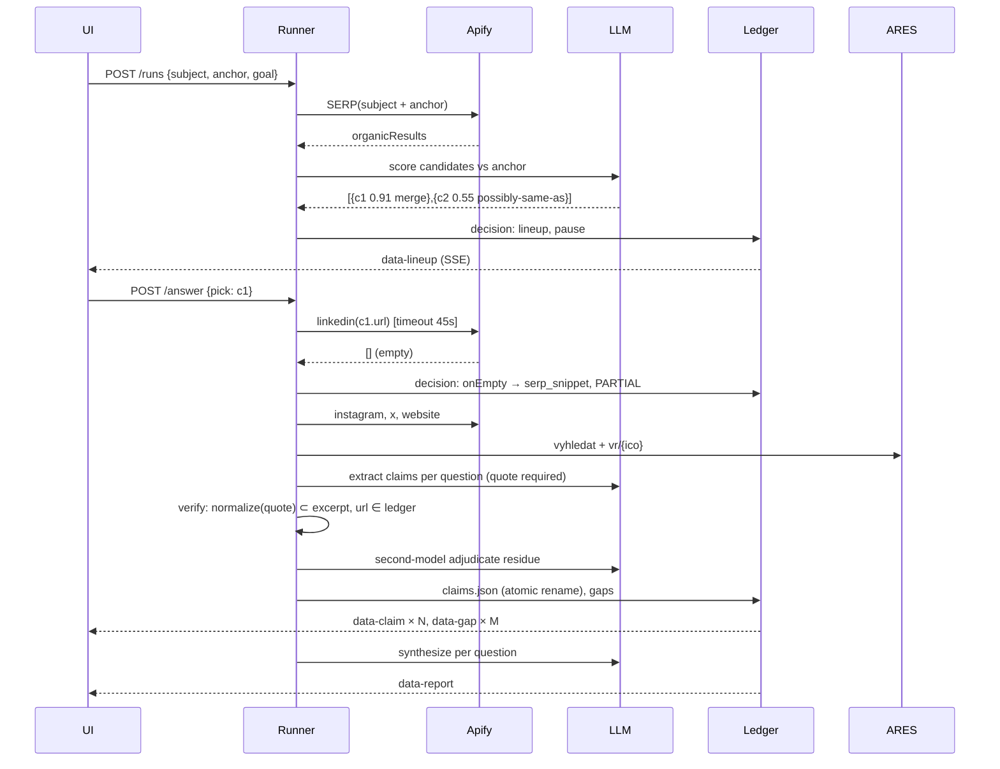
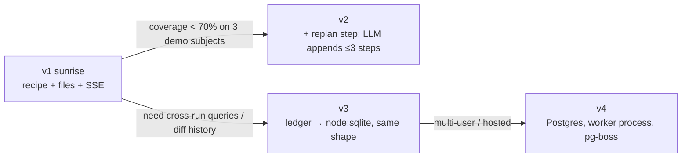
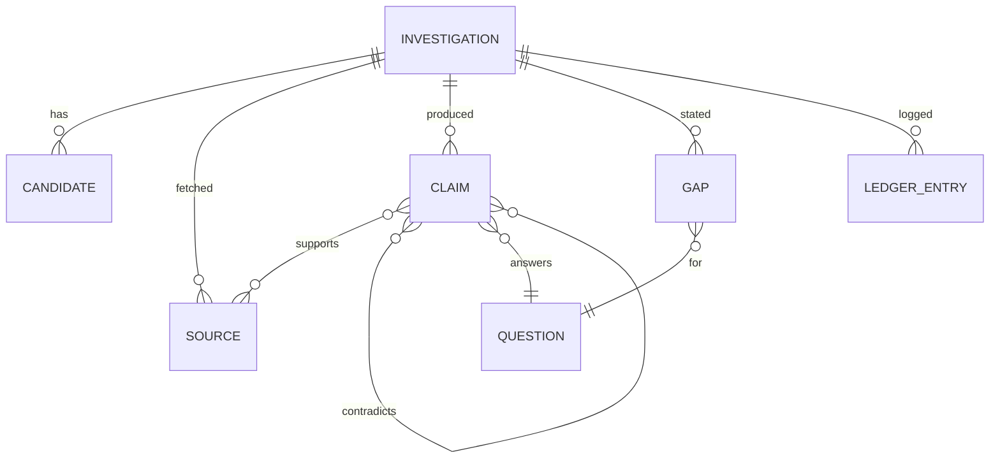

# 00 — Synthesis: architecture for the deep-research agent (Case 01)

**Question**: how do ≤3 people build, in one night, an agent that turns (subject, anchor, goal) into a streamed, sourced, goal-shaped report with namesake handling and honest gaps, and win on value 35% / originality 25% / e2e 20% / tech 10% / honesty 10%?

**Scope**: planner shape, actor access, state store, streaming, verification, replay. **Out of scope**: UI visual design, ElevenLabs wiring, deployment beyond localhost.

**Recommendation**: **Option A "Recipe", built with Option C's ledger-first discipline, plus two declared runtime branches.** One Next.js process. Fixed per-goal recipe with `onEmpty` fallbacks and a pausable `resolve` step. Actors via `apify-client` with cost caps. State = append-only `runs/<id>/ledger.jsonl` + `claims.json` projection (atomic rename). Streaming via AI SDK UI message stream. Verification = deterministic quote-in-excerpt check + second-model residue. Replay = serve old ledger, labeled CACHED.

---

## Context (from `docs/`)
- Brief bans "search and summarise with no goal logic"; wins on goal-changes-substance, namesakes, legible process, honesty.
- Discovery leap-of-faith: A1 LinkedIn actor viability, A3 real goal divergence, A5 resolution correctness.
- Pre-mortem launch-blockers: T1 LinkedIn dead, T2 cosmetic goal switch, T3 wrong namesake, T4 no e2e by T+5h, T5 stall on stage, T6 hallucinated FACT.
- Evidence: none of 4 OSS deep-research agents verify citations; 3–13% of agent citation URLs fabricated (`02`). Anthropic converged on bounded research loop + separate CitationAgent (`01`). ARES v3 returns statutory bodies directly (`01`). Apify MCP `call-actor` returns no output and no cost cap; `apify-client` has both (`01`).

## Options (detail in `03-options.md`, court in `04-steelman.md`)
| | A Recipe | B Agent | C Dossier |
|---|---|---|---|
| Planner | declared per-goal step list, LLM at 4 seams | LLM tool loop | declared step list, CLI |
| Actors | `apify-client` | Apify MCP | `apify-client` |
| State | files / SQLite | Postgres + Realtime | files |
| Stream | SSE data parts | WebSocket | 1 s file poll |
| Replay | ledger | one trajectory | folder |

## Decision matrix

Weights adjusted for a one-night hackathon (justification: evolution headroom matters little past sunrise; delivery and demo risk matter a lot; added **Jury fit** because the brief's scoring is the actual objective).

| Criterion | W | A | B | C | Evidence |
|---|---|---|---|---|---|
| Simplicity & operability | 15 | 4 | 2 | 5 | A one process + files; B Supabase + MCP OAuth + loop guardrails (`03` B Cost); C two processes but zero infra |
| Agentic-dev fit | 10 | 5 | 3 | 5 | A/C declared steps greppable; B emergent plan not greppable (`04` Pros-B #5); strict TS everywhere (`01` Octoverse) |
| Domain fit (DDD) | 10 | 4 | 3 | 4 | Same aggregates; B's `Plan` emergent, budget invariant harder to own (`03` B DDD) |
| Evolution | 5 | 5 | 3 | 4 | A → `replan` step = B gradually; files → SQLite/Postgres by swapping repo (`03` A Evolution) |
| Testability | 10 | 4 | 2 | 5 | C pure functions + golden files; A same with ports; B termination emergent (`03` B Test seams) |
| Delivery speed | 15 | 4 | 2 | 5 | T4 walking skeleton: C's `claims.json` is the contract; A adds route + SSE; B adds DB + MCP (`04` Adv-C #1) |
| Cost | 5 | 4 | 2 | 5 | B unpredictable LLM spend, 15× tokens (`01`); A/C bounded calls with `maxTotalChargeUsd` |
| Risk & reversibility | 10 | 4 | 2 | 3 | B replay non-reproducible, T8 default failure (`04` Pros-B #2,#4); C fails namesake-ask + streamed (`04` Pros-C #1,#2) |
| **Jury fit** (value, originality, live demo) | 20 | 4 | 4 | 2 | B/A can show decisions live; C "wow lowest", looks like recording (`03` C Cost, `04` Pros-C #7); A needs real branch to avoid "configured pipeline" (`04` Pros-A #1) |
| **Weighted** | 100 | **4.15** | 2.65 | 4.05 |

**Sensitivity**: swapping Delivery (15) and Jury fit (20) weights gives A 4.15 vs C 4.20: **flips**. Decision is closer than the number implies. Tiebreaker argued in prose: C's entire advantage is storage discipline and testability, which A can adopt wholesale (`04` Rebuttal C). C's disadvantages (no mid-run ask, no streaming, two processes) cannot be adopted by A without becoming A. So the recommendation is **A with C inside it**. B is not close.

## Recommended architecture

### Container diagram


### Domain / boundary map
```mermaid
flowchart TB
  subgraph Investigation[Investigation context]
    INV[Investigation<br/>id · subject · anchor · goal · status · budget]
    CAND[Candidate<br/>name · profile urls · anchor_match · score · decision: merge | possibly-same-as | rejected]
    INV --> CAND
  end
  subgraph Goal[Goal, value object]
    Q[Question[]<br/>id · text]
    R[Recipe<br/>Step[] · onEmpty]
  end
  subgraph Evidence[Evidence context, immutable]
    SRC[Source<br/>id · url · actor · fetched_at · excerpt · raw_ref · ttl]
  end
  subgraph Claims[Claims context]
    CL[Claim<br/>id · question_id · text · kind FACT|INFERENCE · confidence · quote · supports[] · contradicts[] · rank]
    GAP[Gap<br/>question_id · reason]
  end
  subgraph Ledger[Ledger, append-only]
    LE[Entry<br/>ts · step · kind call|llm|decision|pause · cost_usd · ms · ref]
  end
  INV -- uses --> Goal
  R -- produces --> SRC
  SRC -- extract --> CL
  Q -- unanswered --> GAP
  INV -- every action --> LE
```
Invariants: `Claim.kind = FACT` ⇒ `quote ⊂ Source.excerpt` for ≥1 `supports` and `verify` passed. `Gap` exists iff a `Question` has zero claims after recipe end. `Investigation.budget` (calls, USD, wall-clock) enforced in runner, never in LLM.

### Critical sequence: one run with a namesake pause and an empty source


### Evolution path

Exit cost at each hop: repository swap only; recipe, claim model, UI untouched.

### ER (core aggregates, as JSON today, tables tomorrow)


## Key decisions
| Decision | Choice | Why (cite) |
|---|---|---|
| Planner | Declared recipe per goal; branches = `onEmpty` + pausable `resolve`; `replan` only at T+7h | Anthropic "simplest pattern"; loop failures = unbounded paths (`01`); Pros-A conditions (`04`) |
| Actor access | `apify-client`, not MCP | MCP returns status not output, no cost cap (`01`) |
| Store | `runs/<id>/ledger.jsonl` + `sources/` + `claims.json`; `node:sqlite` when cross-run queries needed (Node 26 has it) | C's discipline (`04`); Postgres-first exit not crossed: one user, one night |
| Streaming | AI SDK `createUIMessageStream` data parts over SSE, tailing ledger | `01` AI SDK 7; survives UI reload (re-tail) |
| Structured output | `Output.array` for claims, `Output.object` for scores; `strict` tools | `01` |
| Verify | deterministic quote-in-excerpt + URL-from-ledger, then second model on residue | 3–13% fabricated URLs; CitationAgent pattern (`01`,`02`) |
| Identity | Sayari two-tier: merge / `possibly-same-as` / ask | `02` §B |
| Claim model | Wikidata-ish: claim + references + rank; contradictions via rank, never delete | `02` §D |
| Demo run mode | `next build && next start` on stage, not `next dev` | Pros-A #5 hot-reload risk (`04`) |

## Risk register (winner's prosecution, each with mitigation)
| # | Risk (`04` Pros-A) | Mitigation |
|---|---|---|
| 1 | Jury reads it as configured search-and-summarise | Two visible runtime branches (lineup pause, onEmpty fallback) rendered as decision cards; per-goal recipes differ in steps *and* questions; diff view |
| 2 | Goal switch cosmetic | E3 gate before any UI: ≥50% claim delta between hiring and due diligence; recipes must call different steps (e.g. only DD calls `ares_vr`; only hiring calls `github`) |
| 3 | Silent empty sources | `onEmpty` declared per step; emits `Gap{reason}` + PARTIAL label; UI shows it |
| 4 | Wrong early merge poisons run | `possibly-same-as` carried as separate candidate; claims tagged with candidate id; lineup pause below threshold |
| 5 | Long run inside route handler dies | Runner is detached promise keyed by id in a module-level Map; SSE tails ledger; `next start` for demo; replay from ledger if lost. Accepted: dev hot-reload kills runs during development |
| 6 | Native SQLite papercuts | Files first; `node:sqlite` is stdlib on Node 26 if needed. No `better-sqlite3` |
| 7 | DDD ceremony invites over-building | Ports = plain function parameters, no DI; one file per context; CLAUDE.md says "no interfaces with one implementation" |

## Pre-mortem on the winner (12 h later, it failed)
1. **Recipes grew `if`s until they were a planner nobody could read.** Signal: a step file >150 lines. Mitigation: branches only via `onEmpty` and `resolve`; anything else = `replan` step or cut.
2. **Verify pass passed everything.** Signal: E6 injected bad FACTs not downgraded. Mitigation: deterministic check first; LLM only on residue; test with fixtures before T+7h.
3. **Ledger tail lost events on reload.** Signal: UI blank after refresh. Mitigation: SSE handler replays whole ledger then tails; events idempotent by id.
4. **Three tracks built three claim schemas.** Signal: TS errors at integration. Mitigation: `claim.ts` Zod schema committed at T+1h; everything imports it.
5. **Cost cap hit mid-demo.** Signal: ledger `budget_exceeded`. Mitigation: per-run cap $0.50 + 12 calls; demo subjects pre-run once for cache.

## First TDD steps (in order)
1. `src/domain/claim.ts`: Zod schemas for Investigation, Candidate, Source, Claim, Gap, LedgerEntry. Test: round-trips, FACT-without-quote rejected.
2. `src/domain/verify.ts`: `verifyClaim(claim, sources) → {kind, reason}`. Test: 3 fixtures (literal match, paraphrase → INFERENCE, URL not in ledger → rejected).
3. `src/domain/resolve.ts`: `scoreCandidate(candidate, anchor) → {score, decision}`. Test: anchor city match, cross-link, below-threshold → `ask`.
4. `src/recipe/goals/*.ts`: question list + steps per goal. Test: hiring and due-diligence recipes share <50% of steps.
5. `src/runner.ts`: `runRecipe(goal, ports)` with fake ports. Test: empty actor result → Gap + fallback step executed; pause resolves on answer; budget stops at cap.
6. `src/ledger.ts`: append + project + atomic write. Test: replay yields identical `claims.json`.
7. Route handlers + SSE, UI against fixture `claims.json` (parallel track from T+1h).
8. First real actor call behind E1 gate.

## Status
`status: draft`. Flip to `active` in `README.md` when accepted.
