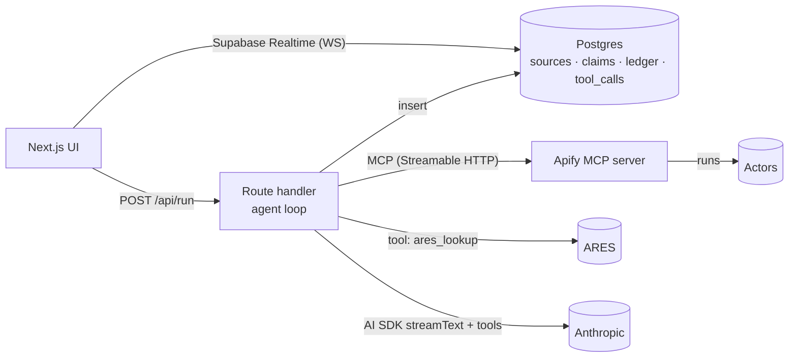
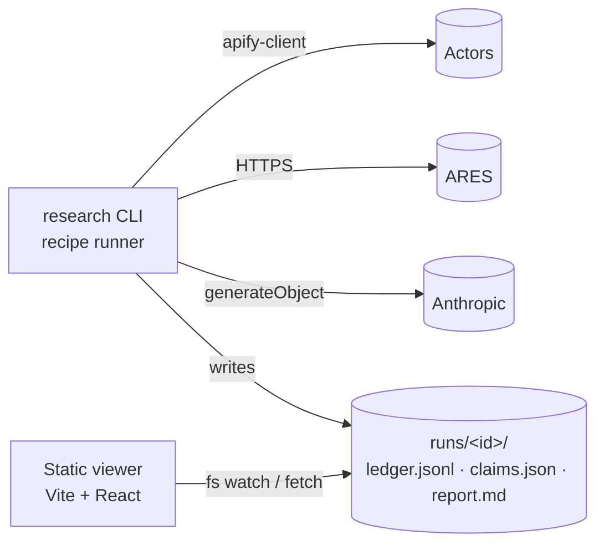

# 03 — Candidates

Question: how to build, in one night with ≤3 people, an agent that turns (subject, anchor, goal) into a streamed, sourced, goal-shaped report with namesake handling and honest gaps.

Three genuinely different shapes. All share the **claim graph** domain model (see `00-SYNTHESIS.md` §Domain); they differ in *who decides what to fetch*, *where state lives*, and *how many processes exist*.

---

## Option A — "Recipe": fixed per-goal pipeline, one Next.js process, SQLite

**Summary.** Each goal is a declarative recipe: ordered list of steps (`serp`, `resolve`, `linkedin`, `instagram`, `x`, `ares`, `website`, `extract`, `verify`, `synthesize`). Planner is a `for` loop over the recipe. LLM is used only at four seams: candidate scoring, claim extraction from excerpts, verification, synthesis. State in one SQLite file (`better-sqlite3`), one table per aggregate. Streaming via Vercel AI SDK UI message stream (custom data parts) from a route handler. Apify via `apify-client` with per-call timeout + cost cap.

```mermaid
flowchart LR
  UI[Next.js UI<br/>claim cards · lineup · board] -- fetch /api/run (SSE data parts) --> RH[Route handler<br/>runRecipe(goal)]
  RH -- apify-client .call() --> AP[(Apify actors)]
  RH -- HTTPS JSON --> ARES[(ARES v3 REST)]
  RH -- AI SDK generateObject --> LLM[(Anthropic)]
  RH -- better-sqlite3 --> DB[(runs.db<br/>sources · claims · ledger)]
  UI -- GET /api/run/:id --> RH
```

**DDD boundaries.** `Investigation` (aggregate root: run, subject, anchor, goal, status) owns `Candidate[]` and the resolution decision. `Evidence` context: `Source` (url, actor, fetched_at, excerpt, raw_ref, ttl) immutable. `Claims` context: `Claim` (text, kind, confidence, supports[], contradicts[], question_id) — invariant: `kind=FACT` requires ≥1 source whose excerpt passed verify. `Goal` is a value object: question list + recipe. `Ledger` is append-only log of every external call with cost.

**Test seams.** Recipe runner takes `{actors, llm, clock}` ports → unit-test with fakes in ms. Claim invariants pure functions. Verify pass testable with fixture excerpts (E6). Integration test: one recorded ledger replayed end-to-end. UI tested against hard-coded claim JSON.

**Evolution.** Recipe → add `replan` step that lets LLM append steps when coverage < threshold (becomes Option B gradually). SQLite → Postgres by swapping the repository (same SQL, Drizzle optional). Add goals by adding a recipe file.

**Cost.** Build: lowest. Run: only actors + 4 LLM calls per step type. Ops: zero (one process, one file).

---

## Option B — "Agent": dynamic tool loop over Apify MCP, Postgres (Supabase) + Realtime

**Summary.** LLM planner with tools = Apify actors exposed via `mcp.apify.com` plus `ares_lookup`, `add_claim`, `mark_gap`. Loop: given goal questions + current claim graph, pick next tool until all questions answered/unanswerable or budget spent. Claims written to Postgres; UI subscribes via Supabase Realtime (or LISTEN/NOTIFY) so board updates live. Verify pass is another tool call at the end.



**DDD boundaries.** Same aggregates. Difference: `Plan` is emergent (tool-call history) rather than declared; `Investigation` owns a `budget` invariant (max tool calls, max USD) enforced in the loop.

**Test seams.** Tools are typed functions → unit-testable. Loop tested with scripted LLM responses (fake model returning fixed tool calls). Harder: termination and cost are emergent; needs property-style tests (budget never exceeded).

**Evolution.** Already "fully agentic"; evolution is in guardrails (planner critique, parallel tool calls). MCP lets you add any of 30k actors without code.

**Cost.** Build: medium–high (MCP auth, Supabase setup, loop guardrails). Run: unpredictable LLM spend (every step is a model call). Ops: Supabase project + MCP OAuth.

---

## Option C — "Dossier": CLI pipeline writes a run folder, static viewer reads it

**Summary.** Do less. A TypeScript CLI (`research --subject --anchor --goal`) runs the fixed recipe and writes `runs/<id>/{ledger.jsonl, sources/, claims.json, report.md}`. "UI" is a tiny Vite page (or Next.js static) that loads a run folder and renders claim cards + lineup; "live" = file watcher re-reads `claims.json` every second. Goal switch = re-run CLI, viewer diffs two `claims.json`. Replay for video = serve an old folder.



**DDD boundaries.** Identical model; persistence is files. `Ledger` is the source of truth; `claims.json` is a projection.

**Test seams.** Best of the three: pure functions in, JSON out; golden-file tests per goal; replay is free.

**Evolution.** Wrap CLI in a route handler → Option A. Files → SQLite trivially.

**Cost.** Build: lowest. Wow: lowest (no streaming tree, visible plumbing). Risk: jury reads "CLI + static page" as less "agentic tool".

---

## Not considered seriously (and why)

- **Python worker + Node UI**: two runtimes, two type systems, one night. Pydantic AI is fine but the split costs integration hours (pre-mortem T4).
- **Wrapping Perplexity/Exa deep-research as the core**: allowed as a component, but jury scores what's on top; it also hides provenance.
- **LangGraph / CrewAI**: framework learning curve + magic control flow fail agentic-fit §2.
