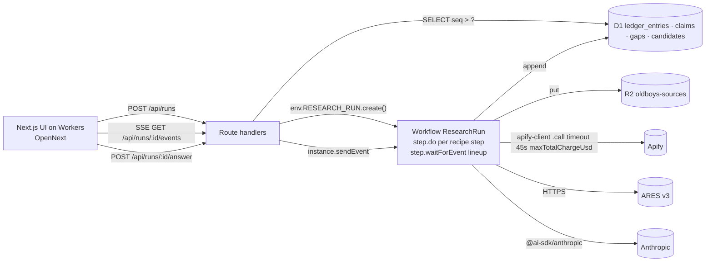

# 00 — Synthesis: Cloudflare platform mapping

**Decision**: Next.js 16 on Cloudflare Workers via OpenNext for UI and API; the recipe runner is a Cloudflare Workflow; D1 is the ledger; R2 holds raw source payloads. One `wrangler.jsonc`, one deploy. All 001 domain code stays pure and port-driven, so the runner can also execute in-process under Vitest with fake ports.

## Container diagram

## Bindings (`wrangler.jsonc`)
| Binding | Type | Purpose |
|---|---|---|
| `DB` | D1 | ledger, claims, gaps, candidates, investigations |
| `SOURCES` | R2 | raw actor output, TTL by lifecycle rule, purge after judging |
| `RESEARCH_RUN` | Workflow | class `ResearchRunWorkflow` exported from `src/worker.ts` |
| `ASSETS` | assets | OpenNext static output |
| secrets | `wrangler secret` / `.dev.vars` | `ANTHROPIC_API_KEY`, `APIFY_TOKEN`, `ELEVENLABS_API_KEY` (optional) |
| vars | `LLM_MODEL_PRIMARY=claude-opus-5-5`, `LLM_MODEL_VERIFY=claude-sonnet-5-5`, `RUN_BUDGET_USD=0.50`, `RUN_BUDGET_CALLS=12` | non-secret config |

## Why Workflow, not Durable Object
The namesake pause is literally `waitForEvent`; retries, step memoisation and a 1024-step cap match the "bounded recipe" decision. A DO would need an alarm loop and manual state machine. Replay stays a ledger read, labeled CACHED, exactly as 001.

## Worker entry
OpenNext emits `.open-next/worker.js`. `src/worker.ts` re-exports its default `fetch` and additionally exports `ResearchRunWorkflow`; `wrangler.jsonc` points `main` at the built wrapper. The Workflow imports only `src/domain/*` and `src/recipe/*`, never Next.js.

## Added risks
| # | Risk | Mitigation |
|---|---|---|
| A | `apify-client` (axios) misbehaves under `nodejs_compat` | E1 gate at T+1h: one `.call()` from `wrangler dev`; fallback = raw `fetch` to `https://api.apify.com/v2/acts/{id}/run-sync-get-dataset-items?timeout=45&maxTotalChargeUsd=` |
| B | Workflow step payload limit (1 MiB) | store actor output in R2 inside the step, return only `{sourceId, excerpt}` |
| C | SSE polling adds ≤1 s latency | acceptable; replay whole ledger on connect, events idempotent by `seq` |
| D | D1 local vs remote drift | migrations in `migrations/`, `wrangler d1 migrations apply --local` in `dev` |
| E | Deploy from Linux CLI only | `pnpm deploy` runs on this machine; CI deploy workflow for `main` |
| F | Next.js 16.4 ships `preview-props.json`, which OpenNext ≤1.20.9 does not inline (Error 1101 on every route) | `next` pinned exactly to 16.3.8 in package.json until opennextjs-cloudflare PR #1356 is released; bump both together |
