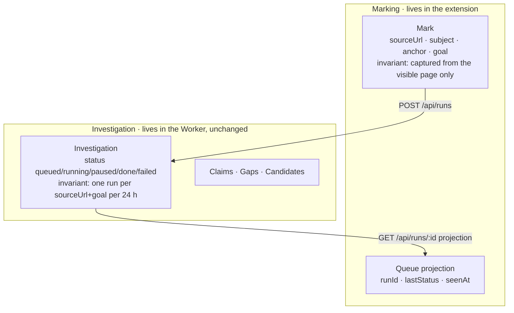
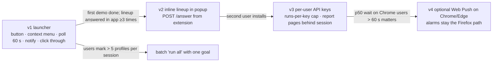

# Browser extension — Synthesis & Decision

> **Recommendation: Option A "Launcher".** One WXT codebase builds Chrome, Edge and Firefox; the extension only captures `{sourceUrl, subject, anchor, goal}`, starts a run, polls a new JSON status route from an alarm, fires an OS notification on `done` or `paused`, and opens the app on click. All research, verification and rendering stay in the existing Worker and Next.js app.
> Confidence: high for Chrome and Edge, medium for Firefox. Verdict would change only if the T+5h core end-to-end gate slips (then: Chrome-only, cached run) or if the WXT Firefox MV3 build fails the first temporary-add-on load (then: Chrome plus Edge ship, Firefox "builds, not demoed").

## Context
The app on `oldboys.asajj.cz` already runs a research recipe as a Cloudflare Workflow with a D1 ledger and an SSE stream (`plans/002`). Users find subjects on LinkedIn and on arbitrary web pages, not in our form. The ask: mark a person where they are found, be told when the sourced profile is complete or needs a namesake pick, click through to the report; Chrome, Edge and Firefox. Hard constraints: Chrome MV3 workers stop after 30 s idle and cut fetches over 30 s; Firefox has no service worker; alarms (30 to 60 s) are the only shared timer; Playwright loads extensions in Chromium only; LinkedIn bans extensions that scrape, modify the page or automate, and scans for extension IDs (`01`, `02`). The jury scores value 35, originality 25, end-to-end 20, tech 10, honesty 10; the extension is a reach play and must stay cheap (`docs/06-extension-pre-mortem.md`, Elephant 1).

## Options considered
| Option | One-liner | Weighted score |
|---|---|---|
| A — Launcher | WXT extension: button + context menu → start, alarm polling of a status route, OS notification, click opens app | **4.25** |
| B — Panel | Extension hosts the app's run view in a side panel iframe; SSE in page context; near-empty background | 2.90 |
| C — Do less | No extension: bookmarklet opens a prefilled app form; the app's own Web Push notifies | 3.45 |

## Decision matrix
Weights adjusted from the defaults: Delivery raised to 15 and a **Promise fit** criterion (does it deliver "mark, get informed, click through" on three browsers) added at 15, both because this is a one-night build against a stated user ask; Simplicity and Agentic fit lowered to 15 each; DDD and Evolution to 10 each.

| Criterion | Wt | A | B | C |
|---|---|---|---|---|
| Simplicity & operability | 15% | 4 — no open connection, state in `storage.local`, truth in D1 (`04` Adv-A 3) | 3 — CSP, iframe, gesture-gated `sidePanel`, two panel APIs (`04` Pro-B 2–4) | 5 — nothing to install or review (`04` Adv-C 1, 3) |
| Agentic-development fit | 15% | 4 — WXT file entrypoints, typed `browser`, fake-browser tests; 0.x churn and auto-imports are the deduction (`01` Frameworks; `04` Pro-A 4) | 3 — integration-only surface, nothing for an agent to test locally (`04` Pro-B 5) | 4 — all app code, Vitest seams; push delivery untestable (`04` Adv-C 4, Pro-C 7) |
| Domain fit (DDD) | 10% | 4 — new *Marking* context, projection of Investigation, dedupe invariant server-side (`03` A) | 4 — no new context, thin host (`03` B) | 3 — Subscription aggregate added for a channel the extension cannot reuse (`04` Pro-C 6) |
| Evolution & headroom | 10% | 5 — inline lineup, batch, per-user keys, optional Chrome push, all additive (`03` A; `04` Adv-A 7) | 3 — needs A's poller for the closed-panel case (`04` Pro-B 1) | 2 — a later extension still needs A's status route and alarms (`04` Pro-C 6) |
| Testability (TDD) | 10% | 4 — `parseProfile`, `nextPoll`, `transition` pure; Playwright Chromium smoke; Firefox manual (`03` A; `04` Pro-A 3) | 2 — CSP, gesture, layout untestable in units (`04` Pro-B 5) | 4 — prefill parser and `sendPush` port in Vitest; real delivery unproven (`04` Pro-C 7) |
| Delivery speed | 15% | 4 — about one person-night plus 60 Worker lines (`03` A) | 3 — depends on a run view that does not exist yet (`04` Pro-B 6) | 4 — half a night, but VAPID, library and table are new (`04` Pro-C 4) |
| Cost | 5% | 4 — polling load is bounded by run count (`docs/06` T8) | 4 | 4 |
| Risk & reversibility | 5% | 4 — degrades to "late notification", never lost run (`04` cross-exam A) | 3 — breaks the closed-panel promise (`04` Pro-B 1) | 5 — nothing to back out |
| **Promise fit** | 15% | 5 — in-page button, context menu, notify, click through, three builds (`04` Adv-A 5) | 2 — no notify when closed; Firefox deferred (`04` Pro-B 1, 3) | 1 — not an extension; no button, no badge (`04` Pro-C 1, 2, 5) |
| **Weighted total** | | **4.25** | **2.90** | **3.45** |

**Sensitivity:** moving 5 pp from Promise fit to Simplicity gives A 4.20, C 3.65, B 2.95. Moving 5 pp from Delivery to Testability leaves the order unchanged. The winner survives every adjacent swap; no tiebreaker needed. C's lead over B is also stable.

## Recommended architecture
```mermaid
flowchart LR
  subgraph ext[extension/ · WXT MV3 · builds chrome-mv3 (also Edge) and firefox-mv3]
    CS[linkedin.content.ts<br/>matches linkedin.com/in/*<br/>shadow-root button<br/>reads location.href, h1, location line]
    CM[context menu<br/>any page, text selection]
    BG[background.ts<br/>SW on Chrome/Edge · event page on Firefox<br/>alarm every 60 s · notifications · badge]
    PU[popup/<br/>queue · goal picker · token field]
    ST[(storage.local<br/>marks[] · token)]
    CS -- runtime.sendMessage start --> BG
    CM -- start --> BG
    PU <-- read/write --> ST
    BG <-- read/write --> ST
  end
  BG -- "POST /api/runs {subject, anchor, goal, sourceUrl} Bearer" --> API
  BG -- "GET /api/runs/:id → {status, facts, inferences, gaps, needsAnswer}" --> API
  BG -- "notifications.onClicked → tabs.create(app/runs/:id)" --> APP
  subgraph cf[Cloudflare · existing worker]
    API[Next.js route handlers]
    APP[/runs/:id report page]
    WF[Workflow ResearchRun]
    D1[(D1 investigations · claims · gaps · candidates)]
    API --> WF --> D1
    API --> D1
  end
```

### Domain boundaries


### Critical flow
```mermaid
sequenceDiagram
  participant U as User
  participant CS as content script
  participant BG as background
  participant API as Worker API
  participant WF as Workflow
  U->>CS: click "Research (hiring)"
  CS->>BG: start {sourceUrl, subject, anchor, goal}
  BG->>API: POST /api/runs (Bearer)
  API->>WF: create(runId)
  API-->>BG: {id}
  BG->>BG: storage.local marks[] += {runId, status: queued}; badge "1"
  Note over BG: worker is killed after 30 s idle
  loop alarm "poll" every 60 s (re-created on every background start)
    BG->>API: GET /api/runs/:id for each non-terminal mark
    API-->>BG: {status, facts, inferences, gaps, needsAnswer}
    BG->>BG: transition(prev, next) → notification? badge?
  end
  WF-->>API: status paused (lineup)
  BG->>U: notification "Jan Novák: pick the right person"
  U->>BG: click notification
  BG->>U: tabs.create(app/runs/:id)
```

## Evolution path


## Risk register (from the winner's prosecution, `04`)
| Risk | Likelihood | Detection signal | Mitigation / accepted |
|---|---|---|---|
| Alarms misfire or stop (Chromium bugs, Firefox alarms lost on restart) | M | popup shows a run older than 3 min with no status update | Poll at 60 s not 30; re-create the alarm in `background` top-level on every start; popup open always reconciles the whole queue against the status route. Accepted: latency, never loss. |
| Notification suppressed (Focus mode) or unsupported options on Firefox (`basic` only, no buttons) | M | tester in E4 misses it | Badge count is always on; notification text carries the action ("pick the right person"); never call `create` twice within one tick. |
| Firefox untestable overnight; WXT may default Firefox to MV2 | M | `wxt build -b firefox --mv3` output or `about:debugging` load fails | One manual check at T+7h; ship line is Chrome plus Edge; dossier and README state Firefox status honestly. |
| Shared `RUN_TOKEN` in `storage.local` leaks | M | spend spike in ledger `cost_usd` | Token pasted by the user, never bundled; Worker caps runs per token per hour; rotate after the video; v3 per-user keys. |
| Report pages public by UUID | H | n/a | Accepted for the hackathon with `noindex` and "purged after judging" visible; v3 puts them behind a session. |
| LinkedIn detects the extension or objects to the injected button | L | account restriction report | Button is user-triggered, reads three visible fields, no automation, no cookies, no LinkedIn branding; context menu works without any LinkedIn permission. |
| WXT 0.x breaking change at 4 am | L | `pnpm install` pulls a new minor | Pin exact version. |

## Pre-mortem (12 months later, this failed because…)
1. **Nobody noticed runs finishing.** Alarm polling silently stopped on a Chromium build; users thought research never completed. Detection: popup shows stale runs. Response: reconcile-on-open was already the safety net; add a "last checked" timestamp to the popup and a manual refresh.
2. **The token leaked from a shared laptop and burned the Apify budget.** Detection: ledger cost spike per token. Response: per-token hourly cap existed; rotate and move to per-user keys (v3).
3. **LinkedIn changed its DOM and the button vanished; users assumed the product died.** Detection: error counter from `parseProfile` returning null. Response: `document.title` fallback and the context menu on selection, both in v1.
4. **A report URL leaked into a Slack channel.** Detection: a complaint. Response: `noindex` and purge were in place; v3 session gating moves up.
5. **Firefox users got an MV2 build that AMO refused.** Detection: the `--mv3` check at T+7h. Response: ship Chrome plus Edge, document Firefox status.

## Assumptions
- SSE and `EventSource` do not keep a Chrome MV3 worker alive (not on the documented keep-alive list; untested).
- `wxt build -b firefox --mv3` produces a loadable Firefox MV3 build with `background.scripts` (docs suggest MV2 default; verify first).
- Edge loads the Chrome zip unchanged (secondary source only).
- LinkedIn's `<h1>` holds the display name on `/in/*` pages (verified by hand tonight; no stable contract).
- Firefox alarm minimum is 1 min (unconfirmed).

## First TDD steps (success criteria, each a test or a gate)
1. `src/app/api/runs/[id]/route.ts` GET returns `{status, facts, inferences, gaps, needsAnswer}` from D1; test with a fake D1 binding. `POST /api/runs` accepts optional `sourceUrl` and returns the existing run for the same `sourceUrl + goal` within 24 h (migration adds the column).
2. `extension/src/lib/parse-profile.ts`: `parseProfile({url, h1, title, locationLine})` → `Mark | null`; tests for a saved LinkedIn header, a missing `<h1>` (title fallback), a non-profile URL.
3. `extension/src/lib/poll.ts`: `nextPoll(marks, now)` picks only non-terminal marks; `transition(prev, next)` returns `{notify?: {title, message}, badge}` for queued→running (no notify), running→paused (notify "pick"), running→done (notify with counts), →failed (notify). Pure, Vitest.
4. `extension/entrypoints/background.ts`: on install and on startup create alarm `poll` (period 1 min); on alarm run the poll; on `notifications.onClicked` open the app. Test with WXT `fake-browser`: after `fakeBrowser.reset()` and a simulated start, an alarm tick triggers one fetch per non-terminal mark and one notification per transition.
5. Playwright Chromium smoke: load `.output/chrome-mv3` with a persistent context, open a local HTML fixture of a LinkedIn header, assert the shadow-root button mounts.
6. Gate: `pnpm check` at the repo root runs the extension's typecheck, lint and tests; the Stop hook blocks the turn on red.
7. Manual gate at T+7h: `wxt build -b firefox --mv3`, load in `about:debugging`, one mark, one notification.
