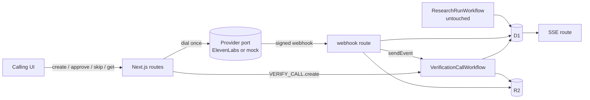
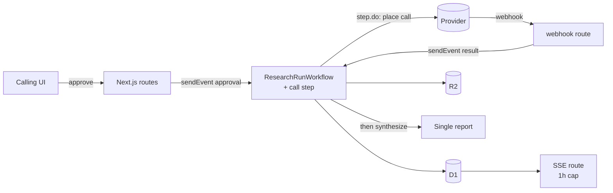
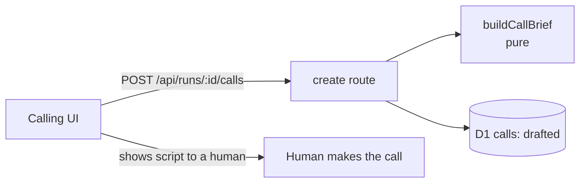

# 03 — Options: candidate architectures

Three shapes: a separate post-run Workflow, an inline recipe step, and "do less" (brief only).

## Option A: Separate `VerificationCallWorkflow` per call, post-run

**Essence:** A call is created from a finished run's gaps, approved by the operator, and runs as its own Workflow instance (id = call id). It writes into the same run ledger. The dial happens once in the approve route handler, not in a Workflow step. The research run is untouched.

- **DDD boundaries:** Verification Call context owns the Call aggregate, its status machine and invariants (consent, one dial, call cap, identity, refusal handling). Research context owns Claim, Gap, Source, Ledger. Crossing: brief input and ingest output only.
- **Test seams:** pure domain modules (brief, ingest, signature, transitions) in Vitest; mock provider drives a full end-to-end test (E-C2); webhook route tested with a fake `VERIFY_CALL` binding; ElevenLabs adapter tested with a `fetch` fake. Loop is seconds.
- **Evolution path:** to inline Option B when a goal needs call evidence before synthesis, reusing domain modules and port. Exit cost if calls are dropped: delete one Workflow, two routes, one migration.
- **Rough cost:** about 10 engineer-hours for a team of 3, with stage 1 (about 6h) shippable alone. Run cost $0.08/min plus Twilio (UNCONFIRMED rate); a 2-minute call is well under $0.50. Attention cost: a second Workflow and a webhook to operate.

## Option B: Inline `call` recipe step

**Essence:** `ResearchRunWorkflow` gets a `call` step that computes gaps, builds the brief, pauses for approval, places the call, waits for the result and ingests it before synthesis. One report contains call evidence. The run blocks up to 1h for approval plus 30 minutes for the result.

- **DDD boundaries:** call logic lives inside the Research context's runner. The Call aggregate has no home of its own; gap computation ("zero claims after recipe end") is needed mid-recipe, which the current Gap definition does not support.
- **Test seams:** step logic needs Workflow event simulation mid-run (approval and result events); recipe-delta tests must be re-checked because step kinds change.
- **Evolution path:** already the end state; backing out means removing a step kind and a status mapping. `paused` is overloaded (lineup and call approval) and the status CHECK cannot change without a table rebuild.
- **Rough cost:** about 14 engineer-hours (touches the core runner, step file likely exceeds 150 lines, SSE cap rethink). Run cost same as A plus idle waits. Highest attention cost.

## Option C: Drafted brief only

**Essence:** A pure `buildCallBrief` plus a `calls` row with status `drafted`. No dial, no webhook, no ingestion. Matches "drafted, never sent" literally and is the cheapest.

- **DDD boundaries:** Verification Call context exists as a schema and one function, with no behaviour or status machine.
- **Test seams:** pure function tests only; fastest loop.
- **Evolution path:** to A requires a new schema (conversation id, consent record, provider, transcript key), webhook route, signature module, Workflow and ingest. Little of C's table survives unchanged. Exit cost is near zero.
- **Rough cost:** about 3 engineer-hours. Zero run cost. Leaves the hard part (webhook, ingestion) unprepared, which is what the request asked for.
