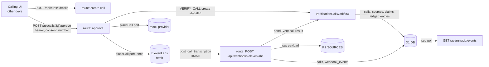
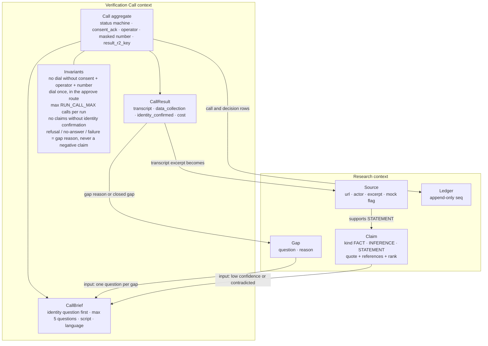
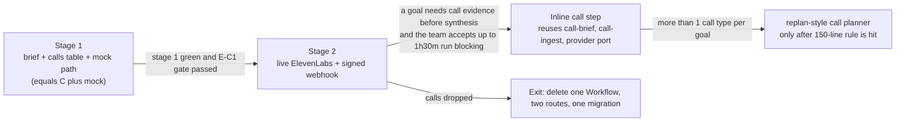

# 00 — Synthesis: ElevenLabs verification calls

> **Recommendation: Option A, a separate `VerificationCallWorkflow` per call, started after the research run.** The research run stays untouched and bounded, the call is the operator's consented action, and the same domain modules and provider port later support an inline step if a goal needs call evidence before synthesis.
> Confidence: medium-high. Verdict flips toward C if E-C1 (live smoke) fails and the team has under 3 hours left, or toward B if a goal must have call evidence in the first report.

## Context

The research run ends with claims and gaps. The team wants an ElevenLabs Conversational AI phone call that asks a consenting callee the open questions and returns answers as evidence. Other developers build the calling UI and dialog. This backend must give them a verified contract (see 06).

Robert's decisions, taken 2026-10-08:
- Calls go only to operator-approved, operator-entered numbers with recorded consent. The backend never scrapes numbers. The demo callee is a volunteer or team member. This respects "outreach drafted and shown, never sent" and "public data only" because the call is the operator's consented action and the transcript is labeled a non-public source.
- Two providers behind one port: live ElevenLabs via plain `fetch`, and a `mock` provider labeled MOCK in ledger and report.
- Definition of done includes a success-criteria loop plus `/simplify` and `/code-review --fix` with all findings applied.

Repo constraints: `claim.ts` is the single source of truth; `ledger_entries.kind` CHECK is `('call','llm','decision','pause')` and changing a CHECK means a table rebuild; the Workflow imports only `src/domain` and `src/recipe`; webhook routes must verify signature before parsing and keep an idempotency table (`rules/security/owasp-compliance.md`).

## Options considered

| Option | One-liner | Weighted score |
|---|---|---|
| A: Separate Workflow per call | Own Workflow instance (id = call id), writes into the run's ledger, research run untouched | 4.20 |
| B: Inline `call` recipe step | `ResearchRunWorkflow` pauses for approval and result before synthesis | 2.65 |
| C: Drafted brief only | Pure `buildCallBrief` plus `calls` row, no dial, no webhook | 4.25 |

Note: the approved plan printed totals of 4.25, 2.70 and 4.20 for A, B and C. Recomputing the weighted sums from the plan's own scores gives the values above. The ranking of A and C is therefore reversed by 0.05, which is inside the noise and handled in the sensitivity note.

## Decision matrix

| Criterion | Wt | A | B | C |
|---|---|---|---|---|
| Simplicity & operability | 20% | 4: one extra Workflow, two routes, one migration | 2: expands step kinds, blocks the run up to 1h30m | 5: one pure function and one table |
| Agentic-development fit | 20% | 4: contract is explicit, steps greppable | 3: planner-like step, hard to reason about | 5: pure code only |
| Domain fit (DDD) | 15% | 5: Verification Call is its own context with its own aggregate | 3: call logic leaks into Research context | 3: context exists but has no behaviour |
| Evolution & headroom | 15% | 5: becomes B by reusing modules and port | 3: already the end state, hard to back out | 2: webhook, schema and ingest all still to build |
| Testability (TDD) | 10% | 4: mock provider gives full e2e in Vitest | 3: needs Workflow event simulation mid-run | 5: pure functions only |
| Delivery speed | 10% | 3: ~10h for team of 3, stage 1 shippable alone | 2: touches the core runner | 5: hours |
| Cost | 5% | 4: $0.08/min plus Twilio, under $0.50 per 2-min call | 3: same plus idle waits | 5: zero |
| Risk & reversibility | 5% | 4: delete one Workflow, two routes, one migration | 2: status CHECK rebuild, report hostage to a phone | 5: nothing irreversible |
| **Weighted total** | | **4.20** | **2.65** | **4.25** |

**Sensitivity:** A and C are within 0.05, and a ±5pp move on Simplicity or Evolution flips them. The tiebreaker is scope, argued in prose: C does not do what was asked (backend prepared for calls) and defers the signed webhook, idempotent ingestion and transcript-to-claims, which are the risky parts (04, Option C prosecution). A is built so that stage 1 of A is C plus the mock path. If time runs out, stage 1 ships alone and is honest and demoable. B is not close under any weighting.

## Recommended architecture



### Domain boundaries



The Verification Call context owns its status machine and all call invariants. The Research context owns Claim, Gap, Source and Ledger. The only crossing points are the brief input (gaps and weak claims) and the ingest output (a Source, STATEMENT claims, a gap change).

### Critical flow

Highest risk: the webhook may arrive before the Workflow waits, and the dial must happen exactly once.

```mermaid
sequenceDiagram
  autonumber
  participant UI as Calling UI
  participant AP as POST /api/calls/:id/approve
  participant P as Provider (ElevenLabs or mock)
  participant D1 as D1
  participant WH as POST /api/webhooks/elevenlabs
  participant R2 as R2 SOURCES
  participant WF as VerificationCallWorkflow
  participant SSE as SSE route
  UI->>AP: to_number, consent_ack, consent_note, operator (bearer)
  AP->>D1: batch: conditional update drafted to dialing (409 if limit hit)
  AP->>P: placeCall (the only dial, number used only here)
  P-->>AP: provider_conversation_id
  AP->>D1: store conversation id, masked number, ledger call row, status in_call
  AP->>WF: VERIFY_CALL.create id=callId params {callId, runId}
  P->>WH: post_call_transcription + ElevenLabs-Signature
  WH->>WH: verify signature on raw body (401 on failure)
  WH->>D1: lookup call by conversation_id (500 if unknown so provider retries)
  WH->>R2: store raw payload
  WH->>D1: batch: update calls result_r2_key + status, insert webhook_events
  WH->>WF: sendEvent call-result {conversation_id}
  Note over WF: load-call checks D1 first; if result_r2_key is set it skips the wait
  WF->>R2: read payload
  WF->>D1: insert source (excerpt = transcript), LLM extract, STATEMENT claims, close gap, ledger rows
  D1-->>SSE: seq poll picks up new ledger rows
```

If `sendEvent` fails, the Workflow's 30-minute wait times out and falls through to `poll-result` (`GET conversation`, 3 tries, 1 minute apart), then `failed` with reason "no result".

## Evolution path



Reused unchanged on the move to B: the three domain modules, the provider port and adapters, the webhook route, the signature module. What B adds: a `call` step kind, a pause status mapping (the status CHECK cannot change without a table rebuild), and an SSE cap rethink (lineup pause plus approval plus result exceeds the 1h cap).

## Risk register (from the Option A prosecution, see 04)

| Risk | Likelihood | Detection | Mitigation |
|---|---|---|---|
| Call-derived claims pass as public FACT | High | FACT claims whose only support is a call source | STATEMENT kind, confidence caps, source label |
| Prompt injection through callee speech | Medium | STATEMENT claims outside the brief's questions | extractor schema restricted to brief question ids; anything else dropped |
| Wrong person answers | Medium | `identity_confirmed = 0` | identity question first; no claims without confirmation |
| Webhook before `waitForEvent`, or unknown `conversation_id` | Medium | `webhook_events` row with no call result for 30 min | result persisted first, Workflow checks D1 before waiting, 500 on unknown id |
| Duplicate dial on retry | Low after fix | two `call` ledger rows for one approval | dial in route handler, conditional status update |
| Concurrent approves exceed `RUN_CALL_MAX` | Low | three non-skipped calls on a run | count inside the conditional update |
| `(run_id, seq)` collision from two Workflows | Low | constraint error in logs | retry once in `appendLedger` |
| Full number persisted | Low after fix | number found in D1 or Workflow params | number only in the approve handler; masked column |
| Czech quality | High (UNCONFIRMED) | `call_successful = false`, garbled transcript | `language` in brief, default `en`, test call in E-C1 |
| Time budget (team of 3, about 10h) | High | stage 1 not green by T+7h | stage 1 shippable alone; stage 2 optional |

## Pre-mortem

Full version in 05. Short narratives, written as if it is the end of the hackathon and the feature failed.

1. **The webhook never arrived.** The URL pointed at a preview deployment and the HMAC secret was copied with a trailing newline. Every live call looked stuck at `in_call`. Detection: `GET /api/calls/:id` shows `last_error`, no `webhook_events` row. Response: poll fallback in the Workflow, fixture signature test (E-C3) run before E-C1, demo on MOCK, labeled.
2. **Organisers ruled the call out of bounds.** The brief says outreach is "drafted and shown, never sent". Detection: answer to A1 asked at T+0. Response: MOCK path is identical from the UI's point of view; the report labels the source a consented phone call or MOCK.
3. **A callee said something false and it shipped as FACT.** The quote-in-transcript check passed by construction. Detection: FACT claims supported only by a call source. Response: STATEMENT kind exists precisely for this, confidence capped at 0.6 and 0.3 without identity confirmation.
4. **The same stranger got two calls.** A retried Workflow step re-dialed. Detection: two `call` ledger rows per approval. Response: dial lives in the route handler, status transition is conditional, so a retry cannot dial again.
5. **The migration was not applied before deploy.** The webhook returned 500 and ElevenLabs retried for 30 minutes. Detection: 500s on the webhook route right after deploy. Response: Robert runs `pnpm db:migrate:remote` before merge; the webhook route deploys only after.

## Assumptions

Carried from the UNCONFIRMED items (see 06 and 02):

- A1: operator-consented calls are inside the brief's rules (ask organisers).
- A2: plain `fetch` outbound call and webhook work from Workers without the SDK.
- A3: webhook HMAC verifies as documented (`t=...,v0=...`, 30-minute tolerance) and arrives within 30 minutes.
- A5: Czech works for the agent. UNCONFIRMED; default language `en`.
- The exact key for prompt text in the override (string `prompt` versus nested `prompt.prompt`).
- Behaviour of an undefined dynamic variable.
- Unit of `metadata.cost` in the webhook (credits versus cents); record raw value and `cost_fiat` from GET.
- Shape of `evaluation_criteria_results` and `data_collection_results` entries (believed `{result, rationale, value}`).
- Field names `platform_settings.data_collection` and `platform_settings.evaluation.criteria`.
- Twilio rates, phone number import endpoint, direct purchase, audio endpoint, webhook create endpoint.
- Workers compatibility of the ElevenLabs SDK (not used).
- Whether Cloudflare buffers a `sendEvent` that arrives before `waitForEvent` registers (design does not rely on it).

## First implementation steps (TDD)

Each step ends green on `pnpm check`. Stage 1 is independently shippable and equals Option C plus the mock path.

Stage 1:
1. This dossier.
2. `claim.ts` gains `STATEMENT` with tests (quote and at least one support required, exhaustive switches). `call.ts` schemas and `transitionCall`, illegal transitions rejected.
3. `call-brief.ts`: identity question first, one question per gap, weak claims included, cap 5, disclosure and consent lines present, GDPR Art. 9 denylist, hiring and due-diligence scripts differ.
4. `call-ingest.ts`: excerpt format, STATEMENT kept when the quote matches a turn, downgraded otherwise, refusal / no-answer / unconfirmed identity yield a gap reason and zero claims, confidence caps.
5. Migration `0004_calls.sql` plus `pnpm db:migrate:local`.
6. Mock provider (tested) and the `PlaceCall` / `FetchCallResult` ports.
7. `VerificationCallWorkflow`, `worker.ts` export, `wrangler.jsonc` binding `VERIFY_CALL`, typegen, cheat file.
8. Routes: create, approve, skip, get, and the shared auth helper.

Stage 2:
9. `elevenlabs-signature.ts`: valid, tampered body, stale timestamp, malformed header, constant-time compare.
10. ElevenLabs adapter with a `fetch` fake test; webhook route with a fake `VERIFY_CALL` binding.
11. `scripts/call-smoke.mjs`, `docs/ops/call-verification.md`, CLAUDE.md and `.dev.vars.example`.

Success criteria S1 to S8 and the fix loop are defined in the approved plan; S7 (live E-C1) is reported NOT RUN unless Robert supplies the ElevenLabs variables and a smoke number.
