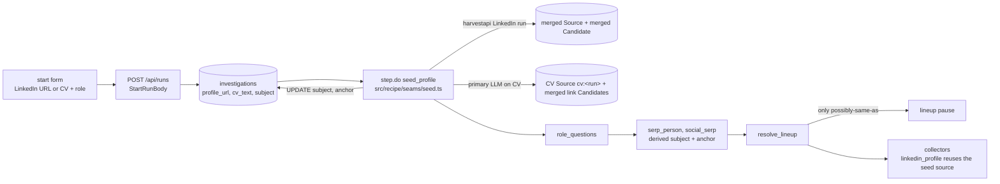

# 00 — Synthesis: profile-first start (hiring)

**Decision (Robert, 2026-10-08)**: oldboys is a hiring tool and the manager always holds a concrete candidate profile. The start form asks for the candidate's LinkedIn profile URL or a pasted CV, plus the role. Name, location and employer are derived from that input, and the given profile is the confirmed identity. The namesake problem shrinks from "which of these people is it?" to "is this other profile also them?".

Example: Josef Buryan, CMO of Groupon, `https://cz.linkedin.com/in/josef-buryan`.

## API contract

`POST /api/runs` (and `/api/start`, which adds the bearer):

```
{ goal, role?, profileUrl?, cvText?, subject?, anchor?, sourceUrl? }
```

- `profileUrl`: any `linkedin.com/in/<handle>` form, normalised to `https://www.linkedin.com/in/<handle>` (no query, no locale suffix); anything else is a 400.
- `cvText`: at most 20000 chars.
- Hiring needs one of `profileUrl`, `cvText` or `subject` + `anchor`. Due-diligence keeps `subject` + `anchor`.
- Extension compatibility: the old `{subject, anchor, goal, sourceUrl}` body still validates. For a hiring run whose `sourceUrl` is a LinkedIn profile, that URL becomes `profileUrl`.
- `investigations.profile_url` and `investigations.cv_text` (migration `0007_profile_first.sql`). A profile-first row starts with `subject = ""` and `anchor = ""`.

## Data flow



- `seed` is a recipe step kind (first step of the hiring recipe). The Workflow runs it in `step.do("seed_profile")` before `role_questions`, because the runner's `StepContext` does not carry the profile URL or CV.
- Profile URL: one `harvestapi/linkedin-profile-scraper` run with the same request and parse as the `linkedin_profile` collector. The profile becomes a merged Source and a merged Candidate (`score 1`, reason "profile given by the manager"). Subject = full name, anchor = profile location, else the profile URL. Employer and headline go into the ledger ref. The run page shows the headline.
- CV: one `primary` LLM call with a Zod schema `{full_name, headline, location, current_employer, links[]}`. The CV is stored as Source `{actor "cv", url "cv:<runId>", identity merged}`, with the first 8000 chars as its excerpt (`CV_EXCERPT_MAX`, raised from 2000 for the CV consistency check, idea #14) and the full text in R2. LinkedIn, GitHub, X and Instagram links become merged Candidates, but only when the link literally appears in the CV text.
- Failure never fails the run. If the actor fails, the subject is the given subject or a name built from the URL handle, the anchor is the profile URL, the Candidate is still merged, and a ledger note says why. If the CV model call fails, the CV source is kept, nothing else is derived, and a ledger note says why. Only when no name can be found at all does the run fail, with "could not work out the candidate's name".
- `linkedin_profile` does not scrape a URL the seed already fetched (`Collector.alreadyFetched`). It returns that source with the note "already fetched at seed", and no request is made.
- The lineup pauses only for `possibly-same-as` candidates, or when nothing is merged (`lineupNeedsAnswer`). The seed's merged candidate counts, so a profile-first run never asks "who is it?".

## What stayed

- SERP queries, resolve scoring, identity marking, extract, verify and synthesize are unchanged. The CV source is a merged source like any other: claims cite it, and a FACT still needs its quote inside the excerpt. Runs with a CV also get the question `cv-consistency` ("CV vs public record", idea #14, `src/domain/cv-check.ts`): CV statements matched, differing (a neutral interview question, never a verdict) or not found publicly; its FACTs must quote a public source.
- The budget is enforced in the runner and the Workflow. The seed's actor run counts as one paid call.
- The extension, curl and due-diligence keep the `subject` + `anchor` pair.
