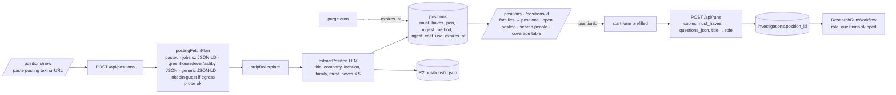

# 00 — Synthesis: position selector (ADR)

**Question**: How does oldboys get a database of positions, each linked to its posting and to its research runs, so a recruiter picks a position, opens the posting, and starts candidate research with the position's must-haves pre-filled, before the sunrise code freeze?

**Scope**: positions table and families; ingest from pasted text or a posting URL; `/positions` selector; pre-filled start; position-conditioned questions. **Out of scope**: company-wide import, ranking candidates, extension capture of LinkedIn Jobs pages (later feeder), taxonomy mapping (ESCO/O*NET), embeddings.

## Context
- The hiring run already derives `mh-*` must-have questions from a free-text role (`role_questions`, skipped when `questions_json` is pre-filled). Only those questions reach extract and synthesize, so a position = control of `questions_json`.
- A peer session staged `/roles` tonight: runs grouped by normalised role text with a coverage table per must-have. It is a selector without a canonical position, so every candidate gets different questions.
- Jobs.cz and Greenhouse/Lever/Ashby expose free, tested JSON paths; LinkedIn's guest endpoint works from a residential IP but is unverified from Workers; StartupJobs has no public path. Details: `11-case-studies.md`.

## Options
| | A: role text is the position | B: positions table + ingest | C: position as a research run |
|---|---|---|---|
| New aggregate | none | Position (must-haves ≤ 5, family enum) | none (Investigation with goal `position`) |
| Ingest | none (URL stored only) | paste first, free fetches, LLM extract in a route | Workflow run with collectors |
| Same questions for all candidates | no | yes | yes |
| Effort | 1.5 h | 2.5 h slim / 4 h full | 6 h + table rebuild |
Full descriptions and diagrams: `12-options.md`; attacks: `13-steelman.md`.

## Decision matrix (1–5, evidence in 10–13)
Weights: demo value 30, simplicity/ops 20, time-to-ship risk 20, agentic fit and test seams 15, evolution path 10, honesty/compliance 5.

| Criterion (w) | A | B-slim | B-full | C |
|---|---|---|---|---|
| Demo value (30) | 2 (link list over existing `/roles`) | 4 (same bar for every candidate, paste → tailored research) | 4 | 3 (slow first interaction) |
| Simplicity / ops (20) | 5 | 4 (one table, one FK, one purge statement) | 3 (five parsers, Apify path, synthetic ledger) | 2 (CHECK rebuild, every `hiring` branch) |
| Time risk (20) | 5 | 4 | 2 | 1 |
| Agentic fit / seams (15) | 4 | 5 (pure plan + extract + projection, fixtures) | 3 (stale HTML fixtures) | 2 (cross-cutting) |
| Evolution (10) | 2 (no canonical must-haves to backfill) | 4 | 4 | 5 |
| Honesty (5) | 3 (implies requirements it never read) | 4 (must-haves editable, method and cost on the row) | 3 | 3 |
| **Weighted / 5** | **3.55** | **4.15** | 3.20 | 2.45 |

Sensitivity: doubling the time weight leaves B-slim ahead of A (4.13 vs 3.79); halving demo value leaves it ahead (3.9 vs 3.6). C never wins under any plausible shift. B-full loses to B-slim because the fetch chain is where the unverified risk lives.

## Recommendation: **B-slim**
A `positions` table owning the must-haves, ingest from pasted text first and free fetches second, LLM extract once per position, questions copied into each run, selector pages that reuse the peer's coverage projection.

**Top 3 reasons**
1. It is the only option that gives every candidate for a position the same questions, which is what makes a position worth having and what the coverage table needs to be comparable.
2. Every new piece is a pure function with fixtures plus one thin route, the shape that shipped five features in an hour tonight; no Workflow, no paid actor, no CHECK rebuild.
3. The data model is the stable part; the risky fetch paths are additive and each one is gated by a probe, so the demo path (paste) never depends on them.

**Top 3 risks** (from the prosecution; full register in `13-steelman.md`)
1. migration 0011 before deploy: `position_id` is nullable and the INSERT names it only when present, so an un-migrated remote keeps serving runs without positions; Robert runs `pnpm db:migrate:remote` before merge.
2. One bad extraction poisons every run for that position: must-haves are shown and editable on the position page before the first run; `ingest_method` and the quote-bearing excerpt are visible.
3. Two lists confuse the demo: the home page links `/positions` only; `/roles` stays as legacy grouping behind the same projection code, not a second product.

## Contracts
- Migration `0011_positions.sql`: `positions(id TEXT PK, title, family, company, location, board, posting_url, external_id, must_haves_json NOT NULL, excerpt, r2_key, ingest_method NOT NULL, ingest_cost_usd REAL NOT NULL DEFAULT 0, created_at, expires_at NOT NULL)`, `UNIQUE(board, external_id)` where both non-null; `ALTER TABLE investigations ADD COLUMN position_id TEXT REFERENCES positions(id)`.
- `POST /api/positions` (bearer): `{postingText?, postingUrl?, title?}` → 201 `{id}`; `PATCH /api/positions/:id` (bearer): `{title?, family?, must_haves?}`; `GET /api/positions` (bearer, like `/api/roles`).
- `StartRunBody.positionId?: string`; when present the insert sets `position_id`, `role = positions.title`, `questions_json = positions.must_haves_json`.
- Family enum: `engineering | data | product | design | marketing | sales | operations | finance | people | other`.
- Vars: `POSITION_INGEST_USD` (cap for the one LLM call, default 0.05). No new secrets.
- Purge: positions past `expires_at` (7 d like sources) and their R2 objects; `RETENTION_DAYS` shared.

## First TDD steps (in order; each slice ends with `pnpm check`)
1. `src/domain/position.ts` + test: Zod `Position`, `Family` enum, `mustHavesToQuestions(position)` producing the `mh-*` `Question[]` shape `role.ts` already emits.
2. `src/recipe/seams/posting-plan.ts` + test: `postingFetchPlan(url | null) → {method, request?}` (pure); fixtures for jobs.cz `/rpd/<id>`, Greenhouse `gh_jid`, Lever, Ashby, LinkedIn `/jobs/view/<id>`, unknown host → `pasted`.
3. `src/recipe/seams/posting-parse.ts` + test: `parsePosting(method, payload) → {title?, company?, location?, text}` with saved fixtures (Jobs.cz JSON-LD, Greenhouse JSON, Ashby JSON); `stripBoilerplate(text)`.
4. `src/recipe/seams/position-extract.ts` + test with `fakeLlm`: `extractPosition(text, ports)` → `{title, company, location, family, must_haves}`; deterministic fallback = `roleQuestions.fallback` when the model is off.
5. migration 0011; `src/app/api/positions/route.ts` as a thin handler around a tested `ingestPosition(db, r2, ports, body)` function (handler pattern of `webhooks/elevenlabs/handler.ts`); cost written to the row.
6. `StartRunBody.positionId` + schema test; `POST /api/runs` copies must-haves; `research-run.ts` unchanged (the `questions_json IS NULL` guard already skips `role_questions`).
7. `src/domain/position-overview.ts`: generalise `roleOverview` to group by `position_id` first, `roleKey` second; test both paths. `/positions`, `/positions/[id]`, `/positions/new` pages reuse `roles-view.tsx` parts; home page link switches to `/positions`.
8. `purge.ts` positions sweep + test; `docs/cli/cheat/oldboys.ps1` for the new var; PR text says "adds migration 0011".
9. Gate E3 (docs/08): same candidate, two positions, ≥ 30 % claim delta; otherwise the selector stays out of the 90 s video.
10. After freeze candidates: LinkedIn guest probe from the Worker (E1), extension capture on `linkedin.com/jobs/view/*`, Apify memo23 behind `POSITION_INGEST_USD`.

## Evolution and exit
Company import = loop over an ATS board listing into the same ingest function. Extension capture = same route. Exit: drop `position_id`, the `/roles` fallback path keeps working; positions rows purge themselves.
