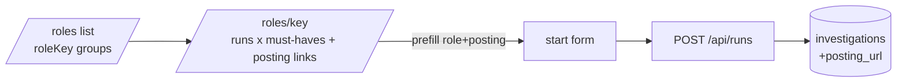
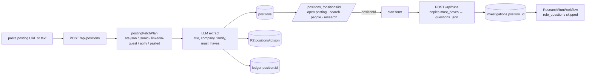
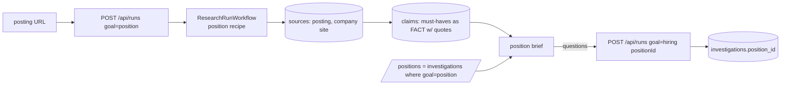

# 12 — Options

Three genuinely different ways to give oldboys a position selector. All keep the brief's hard rules (public data, purge after judging, no scoring of people).

## Option A — "Role text is the position" (do less)
Keep the peer's `/roles` pages (group by `roleKey(role)`) as the selector. Add only:
- `investigations.posting_url` (migration 0011, one column) captured on the start form.
- `/roles/[key]` lists the distinct posting URLs of its runs as outbound links and offers "Research another candidate for this role" → `/?role=…&posting=…` pre-fills the start form.
- A LinkedIn people-search deep link built from the role text.
No positions table, no ingest, no families, no change to `role_questions` (each run still derives its own must-haves from the role string).

- **DDD**: no new aggregate; Role stays a projection over Investigation.
- **Test seams**: `roleOverview` gains posting URLs (pure test); `StartRunBody` gains `postingUrl` (schema test).
- **Evolution**: a `positions` table later is a backfill from distinct `(roleKey, posting_url)`; exit cost near zero.
- **Cost**: ~1.5 h, 1 migration column, no new paid calls.
- **What it does not do**: must-haves differ per run for the same role (LLM nondeterminism); no family grouping; no "open posting then start" from a canonical page; the posting is never read, so questions ignore its actual requirements.

## Option B — Positions table, strategy-chain ingest, families by enum (boring, Postgres-first shape)
New aggregate **Position** owning its must-haves.
- migration 0011: `positions(id, title, family, company, location, board, posting_url, external_id, must_haves_json, source_r2_key, created_at, expires_at)` with UNIQUE `(board, external_id)`; `investigations.position_id` nullable FK; purge list extended.
- `POST /api/positions` (bearer): body `{postingUrl?, postingText?, title?}`. Ingest = pure `postingFetchPlan(url)` → one of `ats-json` (Greenhouse/Lever/Ashby), `jsonld` (Jobs.cz, careers pages), `linkedin-guest`, `apify:memo23` (only if guest fails and `POSITION_INGEST_USD` allows), or `pasted`. Then `roleQuestions`-style LLM extract with a schema `{title, company, location, family (enum), must_haves[]}` on the cleaned text. The raw payload goes to R2 `positions/<id>.json`; cost and method are recorded in a `position_ledger` row (or `ledger_entries` with `run_id = 'position:<id>'`).
- Start: `StartRunBody.positionId`; the insert copies `must_haves_json` into `questions_json` and `title` into `role`, so `role_questions` is skipped and every candidate for the position gets the **same** questions.
- Selector: `/positions` (families → positions, search), `/positions/[id]` = the peer's coverage table filtered by `position_id` (fallback `roleKey` for legacy runs) + "Open posting" + "Search people on LinkedIn" + "Research a candidate" (pre-filled form).
- Families: fixed enum (engineering, data, product, design, marketing, sales, operations, finance, people, other); the LLM picks one; a rule table of CZ/EN keywords provides the fallback when the LLM is off.

- **DDD**: Position aggregate (invariant: must-haves ≤ 5, `mh-` ids, family ∈ enum); Investigation references it by id; the coverage table is a projection over both.
- **Test seams**: `postingFetchPlan` (pure, URL → method), `extractPosition` (seam with `fakeLlm`), parsers per method (fixtures: Jobs.cz JSON-LD, Greenhouse JSON, LinkedIn guest HTML), `familyOf` rule table, `positionOverview` (pure), `StartRunBody` with `positionId`. Route handler kept thin.
- **Evolution**: company import = loop over an ATS board listing; extension capture = same `POST /api/positions`; embeddings never needed below hundreds of positions. Exit: drop the FK, the `/roles` fallback still works.
- **Cost**: ~4 h across 2 agents; 1 migration; ingest = 0 paid calls on the free paths, ≤ $0.50 on the Apify path (capped by `POSITION_INGEST_USD`).

## Option C — Position as a research run (new goal `position`)
Treat the position like a subject: a `position` goal recipe whose steps are `posting_fetch` (strategy chain as a collector), `company_site_crawl`, `similar_postings_serp`; `extract_claims` produces must-haves as **claims with quotes** against the posting Source; `synthesize` writes a position brief. Candidate runs carry `position_id = <that run id>`; their must-have questions are generated from the position run's FACT claims.

- **DDD**: no new aggregate; Position is an Investigation with a different recipe. Must-haves inherit the FACT/INFERENCE discipline.
- **Test seams**: a new recipe file (goal-delta test already exists), one new collector, the question derivation (pure, claims → questions).
- **Evolution**: richest; company research for due-diligence reuses the same crawl; replays/CACHED labels work for positions for free.
- **Cost**: ~6 h; touches `goal` CHECK constraint (migration), recipe index, `/roles` projection, state route; a position takes 1–3 min to "ingest" (Workflow latency) and spends run budget on actors.

## Rejected variants
- **Extension-only capture** (position created from a LinkedIn Jobs tab): needs a new content script and manifest in the `ext` worktree and does nothing for Jobs.cz; it is a later feeder into B's `POST /api/positions`.
- **Embeddings in D1 / Vectorize for families**: fashion at this scale (see 11-case-studies).
