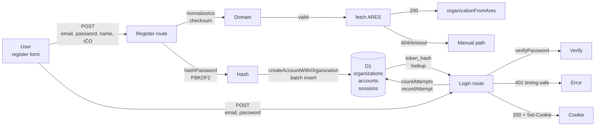
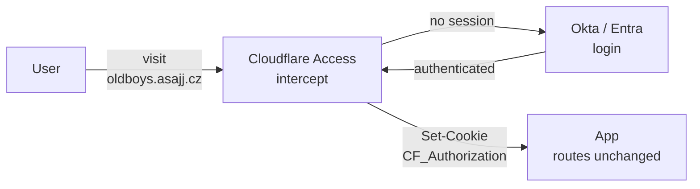
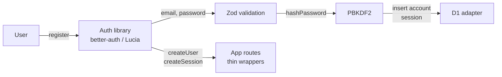

# 03 — Options: hand-rolled, Cloudflare Access, auth library

---

## Option A: Hand-rolled email + password, D1 sessions, WebCrypto PBKDF2 (Recommended)

**Summary:** Zero new dependencies. WebCrypto for hashing, D1 for sessions, base64url for tokens. Email and password validation in Zod, rate limits in D1 `auth_attempts` table, IČO checksum before any network call. Passwords stored as `pbkdf2$100000$<salt b64>$<hash b64>`. Sessions are hashed tokens with 30-day TTL. Tests use fake D1 with SQL prefix dispatch.

**Container architecture:**

**DDD boundaries:**

- **Accounts context:** owns `Account` aggregate, password hashing, session lifecycle, login/logout state machine.
- **Organizations context:** owns `Organization` aggregate, ARES lookup, legal-form mapping, caching policy.
- **Auth attempts:** shared logging for rate limits; both contexts read it.

**Test seams:**

- Unit test: `normalizeIco`, `isValidIco` (checksum formula; 3 valid, 3 invalid cases).
- Unit test: `hashPassword`, `verifyPassword` (round-trip; timing leak via `timingSafeEqual`).
- Unit test: `newSessionToken`, `hashSessionToken` (token format and SHA-256 hash).
- Unit test: `organizationFromAres` (Zod parsing; missing fields; fallback to IČO if name is absent).
- Handler test (fake D1): register (creates org + account + session, 409 on duplicate email, 400 on bad IČO, 429 on 11th in 1h).
- Handler test (fake D1): login (200 on correct, 401 on wrong/unknown, 429 on 6th fail in 15 min, timing leak test).
- Handler test (fake D1): ares lookup (200 cache hit, 404 not found, 400 bad checksum no fetch, 502 upstream error not cached).

**Evolution path:** If a goal later requires call evidence before synthesis, move the `call` step into `ResearchRunWorkflow` and reuse the `PlaceCall` port (new Workflow binding, same route handler pattern). Sessions and password handling remain unchanged.

**Rough cost:** Zero (no external services; D1 and Workers are included). ARES lookups are free.

---

## Option B: Cloudflare Access / Zero Trust in front

**Summary:** Cloudflare Access intercepts all requests to oldboys.asajj.cz and authenticates against an identity provider (Okta, Entra, Google Workspace, GitHub). No custom auth code. Users log in via their provider; Cloudflare returns a cookie. Routes and handlers work unchanged; the Access gateway is transparent.

**Container architecture:**

**DDD boundaries:**

- No custom `Accounts` context (identity lives outside the app).
- **Organizations context:** still owns ARES lookup, company lookup, caching.
- The `investigations` table gains `account_id` (from the CF cookie); self-serve company step is gone (Access handles it).

**Constraints:**

- No self-serve signup flow. Every recruiter must have an account with the identity provider (Okta, Entra, Google Workspace). Hackathon brief says "self-serve", which implies recruiters control their own sign-up.
- Public report pages (`GET /runs/:id`) behind Access means they require authentication. The UUID-only report mode (hackathon launch) would block extension notification clicks. Workaround: whitelist specific UUIDs in Access rules (messy) or exempt report routes (complex).
- No custom company field. The identity provider gives us email and name; IČO and company lookup still need a custom field or a separate form.
- The "company in candidate notice" requires a `LEFT JOIN organizations` in the report loader, same as Option A; Access does not eliminate this work.

**Evolution path:** Access reduces the scope of auth but does not simplify it (ARES work is still there). Useful post-hackathon when company management is mature.

**Rough cost:** Cloudflare Access is free for up to 5 seats (users); paid for larger teams. Okta developer account is free.

**Verdict:** Does not fit the brief ("self-serve") and does not save work on the hard parts (ARES, organization scoping, company in copy). Reachable later without rework.

---

## Option C: Auth library (better-auth / Lucia-style) + D1 adapter

**Summary:** Use a framework-agnostic auth library (better-auth, Lucia 3, or similar) that ships with email/password, PBKDF2, session handling, and adapters for D1. Reduce boilerplate. Library handles token generation, hashing, and cookie setting.

**Container architecture:**

**DDD boundaries:**

- **Auth context:** library-owned; app calls `createUser`, `createSession`, `verifyPassword`.
- **Organizations context:** still custom; ARES lookup, caching, `LEFT JOIN` in report loaders.

**Trade-offs:**

- **Pro:** Boilerplate reduced by ~200 lines. Token generation and session storage are battle-tested.
- **Con:** New dependency chain (better-auth pulls in @hono/node, potentially many sub-deps). On Workers, verify bundle size and compatibility.
- **Con:** lint noise. Most auth libraries use `interface` (not `type`), `export default`, and default exports. ESLint's `consistent-type-definitions` will fail. Requires `eslint-disable` comments or a lint exception.
- **Con:** Heavy handed for a simple case. The library's value is email verification, OAuth, SSO, magic links, etc. For email + password + D1 hashing only, it is overkill.
- **Con:** Evolution. If we later need a custom session store or multiple password strategies (Passkeys, OAuth), the library may not adapt; we may need to fork it.

**Evolution path:** If the team grows and needs email verification or SSO post-hackathon, this is a natural fit. For the demo, it is premature.

**Rough cost:** Same as Option A (no external services).

**Verdict:** Unnecessary complexity for the scope. The code saved by the library is < the lint exceptions and dependency risk created.

---

## Comparison matrix

| Dimension | A: Hand-rolled | B: Access | C: Auth library |
|---|---|---|---|
| **Scope (self-serve + ARES + org copy)** | ✓ | ✗ (no self-serve) | ✓ |
| **New dependencies** | 0 | 0 | 1–3 (auth lib) |
| **Test coverage (fake D1)** | ✓ | ✗ (Access untestable) | ✓ |
| **Lint compliance (type, no warn)** | ✓ | ✓ | ✗ (interface, default exports) |
| **Code size (auth + routes)** | ~250 lines | ~50 (routes only) | ~150 (routes + glue) |
| **ARES work (org, cache, copy)** | ~200 lines | ~200 lines | ~200 lines |
| **Total effort (dev + review)** | 10 h | 8 h (but wrong scope) | 12 h (lint debt) |
| **Agentic fit (clear contracts)** | ✓ | ✗ (Access SDK is large) | ~ (library docs, adapter) |
| **Hackathon viability (shippable alone)** | ✓ | ✗ | ✓ |
| **Post-hackathon evolvability** | ✓ (simple to extend) | ✓ (simple to layer on) | ~ (may need fork) |

---

## Recommendation: Option A

**Rationale:**
- Matches the scope (self-serve, ARES, organization copy).
- Zero new dependencies (risk is minimal).
- Hand-rolled sessions are transparent and testable (proven in the Lucia deprecation and in this codebase's existing patterns).
- Agentic fit: contracts are explicit, test cases are clear, SQL dispatch is the proven pattern.
- Hackathon timeline: 8–10 hours for a small team, parallel WP-A through WP-E.
- Evolution: can become B (add middleware + Access layer) or C (extract to a library) without refactoring.

**Risk register in Option A:** See `plans/009-recruiter-accounts/04-steelman.md` for prosecution and cross-examination.
