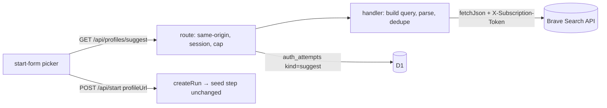
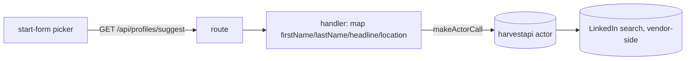

# 03 — Options

Common ground for A, B and C: one route `GET /api/profiles/suggest?q=<name>&hint=<company or city>` behind the session cookie and a same-origin check; a pure parser in `src/domain/profile-suggest.ts` turns hits into `{url, name, headline, location}`; the start form gets a picker whose chosen URL lands in the existing `profileUrl` field. The seed step is untouched.

---

## A. Web-search API (Brave) with `site:linkedin.com/in`


- **DDD**: a `Suggestion` value object in domain; the handler owns "what is a profile hit"; the route owns transport and caps.
- **Test seams**: parser unit tests on real title strings; handler test with fake `fetchJson`; route untested (thin, ARES precedent).
- **Evolution**: swap `searchHits` for an Apify adapter or add company hint from positions; exit cost one file.
- **Cost**: ≈ $0.005 per lookup; ≈1 000 free per month; new secret `BRAVE_SEARCH_KEY`.

## B. Apify `apify/google-search-scraper` run per lookup

```mermaid
flowchart LR
  F[start-form picker] -->|GET /api/profiles/suggest| R[route]
  R --> H[handler]
  H -->|makeActorCall (existing)| A[(Apify actor run 5–20 s)]
  A --> G[(Google SERP)]
```
- Same parser, same route; the adapter already exists; no new secret; hackathon-aligned (Apify in the first screen).
- Latency 5 to 20 s means a button plus a long spinner; Apify's $0.50 minimum cap per run is an accounting oddity (real spend ≈ $0.002).
- **Evolution**: identical to A; the two are the same shape with a different fetcher.

## C. Apify `harvestapi/linkedin-profile-search` (structured people search)


- Best data: structured name, headline, parsed location, company filters; no title parsing.
- $0.10 per search page (20× A), latency not stated, and the data comes from LinkedIn's own search, the Proxycurl exposure. Conflicts with the brief's spirit even if the vendor says "no cookies".

## D. Defer: deep link plus paste

- Keep the URL field; add "Search on LinkedIn" (the link that already exists on `/positions/<id>`) prefilled with the typed name, opening a new tab. Zero cost, zero risk, zero code on the server.
- Does not remove the detour, which is the whole ask; namesake handling stays with LinkedIn's UI.

---

## Side by side

| | A Brave | B Apify SERP | C Apify people search | D defer |
|---|---|---|---|---|
| Latency | < 1 s (ASSUMPTION) | 5–20 s | not stated, actor run | n/a |
| Cost per lookup | ≈ $0.005 | ≈ $0.002 (+$0.50 cap quirk) | ≈ $0.10 | 0 |
| New secret | yes | no | no | no |
| Reads linkedin.com | no | no | yes (vendor) | no (user does) |
| Data shape | title parse | title parse | structured | none |
| Code | handler + parser + picker | same + actor path | handler + picker | link |
