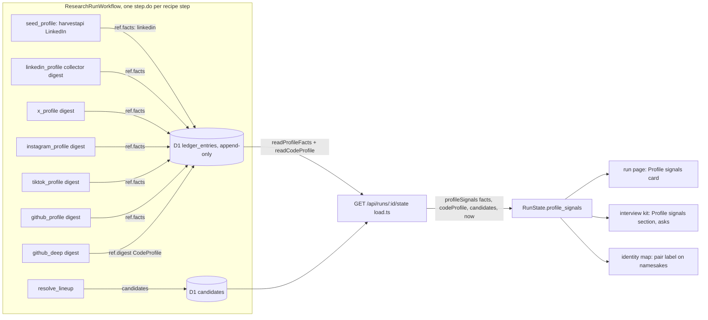
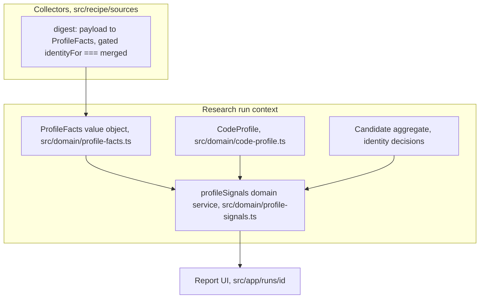
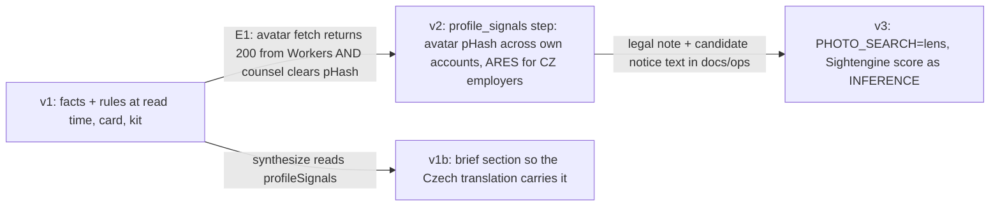

# Profile authenticity signals — Synthesis & Decision

> **Recommendation: Option A, hardened (read-time signals from collector facts, plus the lineup pair label from Option D).** Every platform step that fetches a *merged* account records `ProfileFacts` in its ledger ref; a pure domain module turns facts into plain sentences with a source link and an interview question; the report shows a "Profile signals" card and the kit lists the asks. No new step, no new I/O, no model, $0 per run.
> Confidence: medium. Verdict flips to Option B if spike E1 shows avatar bytes are fetchable from Workers *and* counsel clears pHash; it stays A if LinkedIn creation dates remain login-gated (they are).

## Context

Robert asked for fake-account detection "as a red flag at the profile". The research pack (01, 02) says three things that shape the answer. First, the only authenticity signals with published precision are *pair* signals (same name plus shared photo or bio: 90% TPR at 1% FPR, Goga IMC'15); single-account classifiers reach 34% TPR at 0.1% FPR and humans spot 18% of impersonators. Second, photo detectors misfire on about 1% of real people and miss diffusion images (LinkedIn's own detector), and face matching is Art. 9 biometrics; the honest v1 is numeric account facts, not image verdicts. Third, the brief forbids trustworthiness scores and the repo already bans "fake", "suspicious", "fraud" in claims (`JUDGEMENT`, `src/domain/challenge.ts:52`), so the deliverable is sentences about *accounts* with a source link each, never a verdict about the person. The court (04) established that the seed seam scrapes LinkedIn outside the collectors, that the harvestapi actor returns `verified`, `connectionsCount`, `followerCount`, `premium`, `openToWork` and `photo` which the current schema drops, that collectors cannot emit claims, that `fetchJson` is JSON-only, and that digests must be gated on identity or a possibly-same-as namesake's numbers land in the candidate's report.

## Options considered

| Option | One-liner | Weighted score |
|---|---|---|
| A — Read-time facts | Collectors record `ProfileFacts` for merged accounts; pure rules at read time; card + kit asks | **4.15** |
| B — `profile_signals` step | New step with ARES employer lookup, avatar pHash, optional Lens; signals as claims | 2.90 |
| C — Model question | One `profile-signals` question; the extract model writes INFERENCE claims | 2.45 |
| D — Lineup pair label only | Deterministic "same headline as the confirmed profile" on namesakes; nothing on own accounts | 3.20 |

## Decision matrix

Weights are the skill defaults; "Delivery speed" raised to 15% and "Evolution" lowered to 10% because this is a hackathon feature with a demo deadline (one-line justification: T+ gates in CLAUDE.md).

| Criterion | Wt | A | B | C | D |
|---|---|---|---|---|---|
| Simplicity & operability | 20% | 5 — same path as `code_profile` (04 A-adv 1: `runner.ts:153`, `code-profile.ts:116`) | 2 — new port for bytes, ARES fuzzy matching, flags (04 B-pro 2, 4) | 4 — one question (04 C-adv 2) | 5 — a few lines in resolve (04 D-adv 3) |
| Agentic-development fit | 20% | 4 — repo's own pattern, table-driven rules; 9 touch points incl. seed (04 A-pro 2) | 2 — contract change for claims, image lib dependency (04 B-pro 1, 2) | 3 — prompt edits, non-deterministic feedback (04 C-pro 5) | 4 — small, typed, testable |
| Domain fit (DDD) | 15% | 4 — facts are value objects of the run; signals a domain service; outside the claims pipe (04 A-pro 5) | 3 — Sources are the right ticket in, but third-party pages are "unverified" and get dropped (04 B-pro 1) | 2 — extract prompt says claims are about the subject, never sources (04 C-pro 2) | 4 — doppelgangers belong in identity resolution |
| Evolution & headroom | 10% | 4 — B's I/O step later just writes more facts (03 A) | 4 — already the end state | 2 — replaced signal by signal | 3 — own-account signals still missing |
| Testability (TDD) | 10% | 5 — one fixture per rule, screen test, read-back test (05 E3) | 3 — fake fetch tests exist; pHash fixtures; flag tests | 1 — eval replays recorded answers only (04 C-pro 5) | 4 — pure pair function |
| Delivery speed | 15% | 4 — about a day (03 A) | 2 — about two days plus legal wait (03 B) | 5 — hours | 5 — half a day |
| Cost | 5% | 5 — $0 per run | 3 — $0 default, Lens $0.005 per match | 5 | 5 |
| Risk & reversibility | 5% | 4 — delete one file and one card; risk is noise on real people (T1) | 2 — photo processing before legal answer (04 B-pro 3) | 3 — honesty risk when the model invents a signal | 4 — but a label can harm a real third person (04 D-pro 4) |
| **Weighted total** | | **4.15** | **2.90** | **2.45** | **3.20** |

**Sensitivity.** Swapping Simplicity and Agentic fit changes nothing (A leads both). Raising Delivery speed to 25% and dropping Simplicity to 10% gives A 4.15, D 3.35, C 2.75: A still wins. A loses only if "Domain fit" is weighted ≥ 40% *and* B's claims-pipe objection is fixed, which is not the case today. D's pair label is cheap and orthogonal, so the recommendation folds it into A (one rule in the same domain module) instead of treating it as a rival.

## Recommended architecture



### Domain boundaries



### Critical flow

```mermaid
sequenceDiagram
  participant W as Workflow step x_profile
  participant C as x collector
  participant L as D1 ledger
  participant S as state route
  participant D as profileSignals
  participant U as run page
  W->>C: requests(ctx) for the merged X handle
  W->>C: parse(payload) → Sources
  W->>C: digest(payloads, ctx) → ProfileFacts[] (merged only)
  W->>L: ledger ref { ..., facts }
  U->>S: GET /api/runs/:id/state
  S->>L: ledger rows, candidates
  S->>D: profileSignals({ facts, codeProfile, candidates, now })
  D-->>S: { signals[], not_checked[], pairs[] }
  S-->>U: RunState.profile_signals
  U->>U: card: sentence + source link per signal; asks into the kit
```

## Rules (v1, thresholds from literature, untested on Czech data)

| Id | Fires when | Sentence template (describes the account) | Ask |
|---|---|---|---|
| `young-account` | `created_at` within 180 days of `now` | "The {platform} account was created on {date}." | "Your {platform} account was created on {date}. Is it your only account there?" |
| `account-vs-career` | `created_at` within 365 days *and* LinkedIn `earliest_experience_year` ≤ now − 5 | "The {platform} account dates from {date}; the confirmed LinkedIn profile lists roles since {year}." | same as above |
| `follow-asymmetry` | `following` ≥ 500 and `following` ≥ 10 × `followers` | "{platform}: {followers} followers, follows {following}." | null |
| `forks-only` | CodeProfile `repos_owned` ≥ 5 and `forks_excluded` ≥ 0.8 × `repos_owned` | "GitHub: {forks} of {owned} public repositories are forks." | "Which of your GitHub repositories is your own work?" |
| `linkedin-verified` | LinkedIn `verified === true` | "LinkedIn shows the verified badge on this profile." | null (positive) |
| `few-connections` | LinkedIn `connections` < 50 and `earliest_experience_year` ≤ now − 5 | "LinkedIn: {n} connections; roles listed since {year}." | null |
| `same-headline` (pair) | a non-merged lineup candidate whose snippet is `nearDuplicate` to the confirmed headline, headline ≥ 6 tokens | "A namesake profile on {platform} carries the same headline text as the confirmed profile." | null |
| `not-checked` | per platform with no facts; LinkedIn creation date always | "LinkedIn does not publish the account creation date without login." etc. | null |

Every template passes the `JUDGEMENT` and ACCUSATION screens in a unit test. No colour, no count, no verdict word in the card. Caveats printed with the card: public data only; thresholds from literature; state-actor fraud with stolen identities is not detectable from public profiles.

## Evolution path



## Risk register (from A's prosecution, 04)

| Risk | Likelihood | Detection signal | Mitigation / accepted |
|---|---|---|---|
| Headline signal empty for LinkedIn (creation year login-gated) | Certain | card shows the not-checked line on every run | Accepted; LinkedIn uses `verified`, connections vs career, and the X/GitHub dates |
| Seed-scraped LinkedIn profile bypasses collectors | Certain | no linkedin facts on profile-first runs | Seed step writes `ref.facts` from the same `harvestProfiles` parse (build step 3) |
| Namesake's numbers recorded (possibly-same-as requests) | Medium | facts whose url is not under a merged candidate | `digest()` keeps only payloads whose url has `identityFor === "merged"`; test with a possibly-same-as fixture |
| Signals fire on everyone | High | E2 on 5 subjects | Relative thresholds, follow-asymmetry needs both conditions; E2 gate before UI |
| Verdict by juxtaposition | Medium | copy review | Sentences state one fact each; the "vs career" rule names both facts and asks a question, never concludes |
| Outside the claims pipe (no verify record, absent from Czech brief) | Certain | translated report lacks the card | Accepted for v1 as with `code_profile`; v1b adds a brief section |
| Two truths per number (excerpt and facts) | Low | drift between card and excerpt | facts come from the same parsed payload in the same `parse` call |

## Pre-mortem (winner)

1. *Demo day: the card on all three demo subjects says "created 2023, 40 followers" and a judge calls it a smear.* Detection: E2. Response: thresholds relative and conjunctive; "followers" alone is never a signal.
2. *A judge asks "is this a trust score?"* Detection: any colour or count in the card. Response: sentences only, caveat lines, card title "Profile signals".
3. *A real namesake is labelled as sharing the headline and the recruiter reads "impostor".* Detection: pair label with a short generic headline. Response: ≥ 6 tokens and `nearDuplicate` 0.8; wording "carries the same headline text".
4. *harvestapi renames `connectionsCount` and LinkedIn facts vanish silently.* Detection: `not-checked` line appears for LinkedIn on fresh runs. Response: schema fields optional, line names the missing platform.
5. *Someone enables a photo step without the legal note.* Detection: flag present without `docs/ops/profile-signals.md`. Response: the flag does not exist in v1.

## Assumptions

- A5 (facts present): verified from the actor docs for harvestapi (`verified`, `connectionsCount`, `followerCount`, `premium`, `openToWork`, `photo`), X (`createdAt`, `followers`), GitHub (`created_at`, `followers`), Instagram (`followersCount`, `followsCount`, `postsCount`, `verified`). Instagram and TikTok carry no creation date (ASSUMPTION for TikTok).
- Thresholds (180 days, 365 days, 10×, 500, 80% forks, 50 connections, 5 years) are from the literature's direction, not calibrated (ASSUMPTION; E2 gates them).
- Pair label precision transfers from Twitter 2015 to LinkedIn/SERP snippets only by analogy (ASSUMPTION).

## First implementation steps (TDD)

1. `src/domain/__tests__/profile-facts.test.ts`: `readProfileFacts` returns [] for old runs, newest row per step wins, malformed JSON skipped; `experienceYear` picks the earliest year.
2. `src/domain/__tests__/profile-signals.test.ts`: one fixture per rule, an "all quiet" fixture (typical candidate: 2019 X account, 120 followers, 300 following, LinkedIn 400 connections) that yields only not-checked lines, the pair fixture, and the screen test (`JUDGEMENT`, ACCUSATION) over every produced sentence and ask.
3. Collectors: `digest()` on x, instagram, tiktok, github, linkedin, bluesky, youtube returning facts for merged urls only (test: possibly-same-as payload yields []); harvest schema gains the six optional fields; seed writes `facts` into its ledger ref.
4. State: `profile_signals` in `RunState` and `load.ts`; card `profile-signals-card.tsx` + text helper; interview kit section; identity map tooltip for pair labels.
5. E2 on the demo subjects from the live ledger (`GET /api/runs/:id/state`) before the UI is merged.
