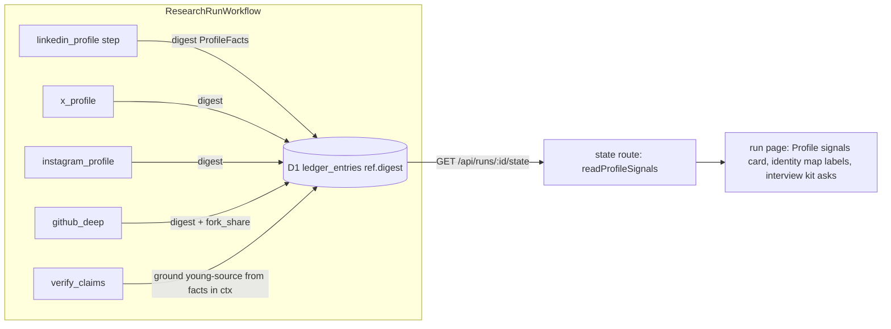
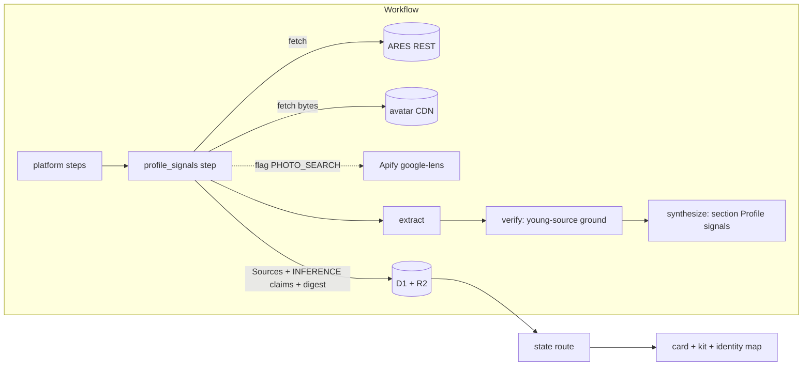
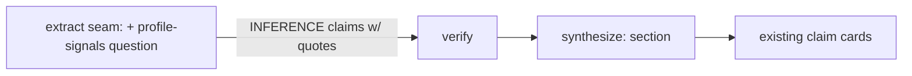
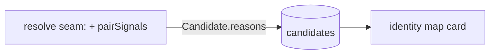

# Options — where profile authenticity signals are computed and shown

Four genuinely different shapes. All four obey the brief: no score of the person, every line links a source, FACT only with a quote, `JUDGEMENT` words never appear. "Signal" below always means a plain sentence about a *source* ("account joined 2025-08 · 12 followers · follows 1 840 · source"), never a verdict.

Shared vocabulary (bounded context **Profile signals**, inside the existing **Research run** context):

```ts
// src/domain/profile-signals.ts (pure)
type ProfileFacts = {            // what one collector read about one account, each with the URL it came from
  platform: string; url: string; handle: string | null; display_name: string | null;
  created_at: string | null; followers: number | null; following: number | null; posts: number | null;
  connections: number | null; verified: boolean | null; premium: boolean | null; open_to_work: boolean | null;
  bio: string | null; photo_url: string | null; default_photo: boolean | null;
  earliest_experience_year: number | null;  // LinkedIn only
  fork_share: number | null; empty_repos: number | null; // GitHub only
  source_url: string;
};
type Signal = { id: string; profile_url: string; text: string; source_url: string; ask: string | null };
```

## Option A — Read-time signals from collector digests (no new step, no new I/O)

**Summary.** Every platform collector that already fetches a confirmed profile (`linkedin`, `x`, `instagram`, `tiktok`, `youtube`, `bluesky`, `github`, `github_deep`) adds a `digest()` returning `ProfileFacts` (the `github_deep` pattern, `Collector.digest` → `ref.digest` in the step's ledger row). A pure `readProfileSignals(rows, candidates)` in `src/domain/profile-signals.ts` collects the latest digest per step, computes per-profile and pair signals deterministically (thresholds in one table), and the state route returns `profile_signals` next to `code_profile`. The run page shows a "Profile signals" card; the interview kit appends the `ask` lines; the lineup (identity map) shows the pair signals on namesake candidates. The devil's advocate gets a fifth ground `young-source` computed in `forkPrecheck` style (no model).



**DDD.** `ProfileFacts` is a value object owned by the Research run context; `Signal` derivation is a domain service with no I/O. Collectors stay the only place that knows actor payload shapes.

**Test seams.** Unit: `profileSignals(facts[], candidates)` table-driven (one fixture per rule, one "all quiet" fixture = demo subject); each collector's `digest()` from a stored payload fixture; `JUDGEMENT`/ACCUSATION screen over every produced sentence. Integration: state route test with ledger rows. No Workflow change beyond what `digest` already does.

**Evolution.** v2 adds Option B's I/O step for employer existence and photo reuse without touching v1 (the step just writes more `ProfileFacts`). Exit cost: delete one domain file, one card, 8 small `digest()` functions.

**Cost.** ~1 day of agent work; $0 per run.

**Known limits.** Signals are not claims: they are absent from the Czech brief translation and from `Brief.sections` unless the synthesize seam reads them too (small extra). LinkedIn creation year is login-gated, so the top signal for LinkedIn is "earliest experience vs `verified`/connections" only.

## Option B — A `profile_signals` recipe step with free REST I/O, signals become INFERENCE claims

**Summary.** A new hiring step `profile_signals` (kind `actor`, collector `rest/profile-signals`) runs after the platform steps and before `extract_claims`. `requests()` builds free REST fetches: ARES `ekonomicke-subjekty` search for each employer on the confirmed LinkedIn profile (cap 6), a `HEAD`/`GET` of each confirmed avatar (bytes → 64-bit pHash in the Worker, no face model), and, behind `PHOTO_SEARCH=lens`, one paid Apify Google Lens run (`s-r/google-lens`, $0.005/match) per confirmed avatar. `parse()` turns ARES records and Lens hits into Sources (so an employer record or a page reusing the photo is a linkable source with an excerpt). `digest()` combines its payloads with `ctx.sources` excerpts (follower lines, joined lines already in the excerpts) into `ProfileFacts[]` + `Signal[]`. The step also returns INFERENCE claims under a new base question `profile-signals` so verify, brief, sections, translation and the interview kit all see them through the existing pipe.



**DDD.** Same value objects as A; the step is an application service in the recipe; employer existence lives next to the due-diligence ARES source (reuse `src/recipe/sources/ares.ts` request builder).

**Test seams.** Collector unit tests with fake fetch (existing convention), pHash unit test on two fixture PNGs, claim screen test, runner test that the step honours the 16-actor cap and `PHOTO_SEARCH` off by default. Workflow smoke on one demo subject.

**Evolution.** Flags flip on photo search once legal is settled; Sightengine AI-image score as a later `followUp`. Exit cost: remove one step from the recipe; sources already stored stay valid.

**Cost.** ~2 days; $0 per run by default, +$0.01–0.03 with Lens on; ARES adds ~6 fetches (each under 1 s) to a 45 s step budget.

**Known limits.** Avatar fetch from LinkedIn/Instagram CDNs may 403 from Workers (E1 in 05); the step must degrade to a named `not_searched` reason. INFERENCE claims about accounts pass through `extract`'s Art. 9 and `JUDGEMENT` screens, so wording must be fixed templates, not model prose.

## Option C — Model-derived signals in the existing LLM seams

**Summary.** Add a base question `profile-signals` ("Which public accounts show creation dates, follower counts or bios that do not fit the stated career?") to the hiring recipe. `extract` already produces claims per question from confirmed excerpts, so the model writes INFERENCE claims ("X account joined 2025-08 while the LinkedIn profile lists roles since 2012") with quotes; `verify` challenges them like every other claim. No new domain module, no new step, one new question and a prompt line in the challenge seam.



**DDD.** Nothing new; the question list is already dynamic per role.

**Test seams.** Eval set (`pnpm eval`) with 3 fixtures; prompt-snapshot test. Non-deterministic by construction: the only fast seams are screens.

**Evolution.** Can later be replaced by A or B signal by signal. Exit cost: delete one question.

**Cost.** Hours; $0.00x per run (one more question in the same extract call).

**Known limits.** The model decides what is a signal and may miss or invent thresholds; cannot compute pair signals across the lineup (rejected candidates are not in confirmed excerpts); the brief says "honesty 10" and a judge can ask "where is the rule?".

## Option D — Do less: pair signals in the identity lineup only

**Summary.** No card. `resolve` already builds `reasons` per candidate; add deterministic pair signals between every lineup draft and the confirmed profile (same display name + near-duplicate bio via `nearDuplicate`, same photo URL hash when the SERP payload carries one) and render "shares bio with the confirmed profile" in the identity map. Everything about the candidate's own accounts (age, ratios) is deferred.



**DDD.** Stays within identity resolution (where doppelgangers belong).

**Test seams.** `pairSignals(draft, confirmed)` unit tests; seams test for the reasons.

**Evolution.** A or B later for own-account signals. Exit cost: trivial.

**Cost.** Half a day; $0 per run.

**Known limits.** Covers only impersonation of the candidate (Goga pair test), not fabrication; SERP hits rarely carry photo or bio text, so most pairs are name-only, which Goga shows is 4% precision at loose thresholds: the label must be conservative or it misleads.
