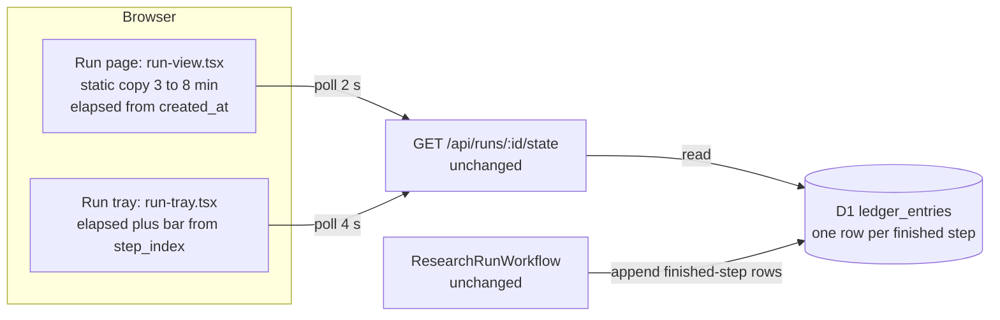
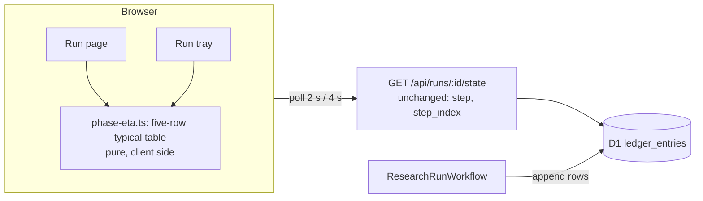
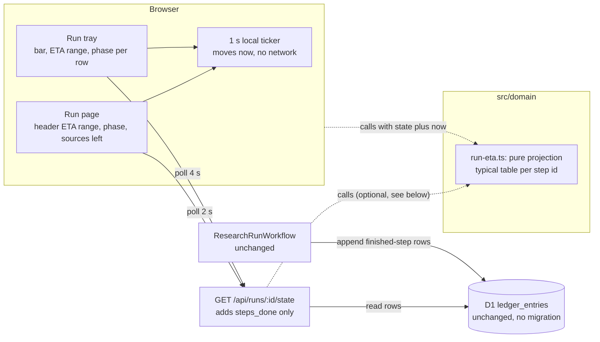
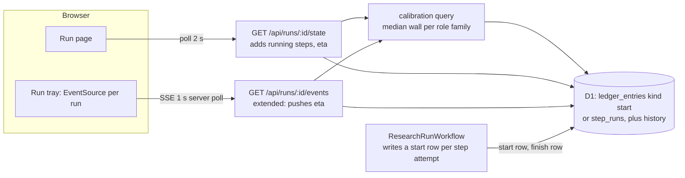

# Options and steelman court: run progress communication (plans/015)

Inputs: `evidence/context.md` (the ask, measured step timings, hard constraints), plans/013-run-latency baseline, and the code read for this document: `run-tray.tsx`, `run-tray-store.ts`, `run-view.tsx`, `state.ts`, `state/load.ts`, `run-cost.ts` and its test, `research-run.ts` pools, `goals/hiring.ts`, `migrations/0001_init.sql`, `events/route.ts`, `rules/README.md`.

Facts used throughout (all from the repo or the context file):

- The ledger has one row per FINISHED step (`step`, `ts`, `ms`, `kind`). It has no start row, and the `kind` CHECK allows only `call, llm, decision, pause` (`migrations/0001_init.sql`).
- `step` in the state route is the last step that wrote a row. With pools of 6 in parallel it is not "what is running now", so `step_index / step_count` jumps (`load.ts`, `trayRow`).
- `runCost` is the precedent for a pure ledger projection: rows in, small object out, pauses excluded, invalid input clamps to 0, test next to it (`run-cost.ts`, `run-cost.test.ts`).
- Measured wall time is 144 to 604 s without a human pause (baseline, 10 prod runs). Plans/013 phases 2 and 3 aim at about 100 s, then 60 to 75 s. Phase 1 is shipped but not yet measured live.
- An SSE route exists (`events/route.ts`) but it polls D1 every second per connection. The page and tray poll `GET /state` at 2 s and 4 s.

---

# Part 1: Options

## Option A: Do less (copy fix, elapsed time, bar in the tray)

**Summary.** Change the static line to "Usually 3 to 8 minutes". Show "Started N min ago" and a thin progress bar in the tray row, reusing the existing `trayRow().progress` (`step_index / step_count`). No new module, no route change. Everything else stays as it is.

**DDD boundary map.**
- Owner of "how long it takes": nobody. The number 3 to 8 lives as a string literal in `run-view.tsx`.
- Typical-duration table: does not exist.
- Client may compute: elapsed seconds and the step share, both from fields it already gets.
- Invariant that nobody guards: the copy matches reality. It will rot the first time plans/013 lands.

**Test seams.**
- Vitest: `trayRow` already has tests; add one case for the elapsed field if it goes in the store.
- Route test: unchanged.
- Playwright: none needed. A manual look at the tray.

**Evolution path.**
- Plans/013 phases 2 and 3 make the copy wrong in the other direction ("3 to 8" when runs take 1). Someone must remember to edit a string.
- Calibration: manual, by hand, after each speed phase.
- Exit cost: close to zero. It is already throwaway; any other option replaces it.

**Rough cost.** 3 files (`run-view.tsx`, `run-tray.tsx`, `run-tray-store.ts`) plus `CHANGELOG.md`, about 40 to 60 lines, no migration. Under an hour.

## Option B: Client-side phase model

**Summary.** The page and tray map the five human rows to typical durations (for example "Searching" 60 s, "Right person" 10 s, "Work history" 60 s, "Fact check" 15 s, "Writing" 60 s). They compute an ETA range from elapsed time and which row is active. The route does not change. A new pure helper lives next to `state.ts`.

**DDD boundary map.**
- Owner of the estimate: a helper in the UI layer (`src/app/runs/[id]/`), not the domain.
- Table: keyed by the five UI rows, which are a presentation grouping of 30-odd recipe steps. The mapping from step ids to rows already lives in `stepRows`.
- Client may compute: everything. That is the weakness: the estimate is a UI concern with no domain home.
- The ETA ignores which steps actually remain, so a run that skipped the Czech registries or has no GitHub step looks the same as one that did not.

**Test seams.**
- Vitest: pure `phaseEta(rowIndex, elapsedMs)` cases: each row, overrun, paused.
- Route test: unchanged.
- Playwright: one smoke that the tray shows a range.

**Evolution path.**
- Plans/013: the five-row table is coarse, so a change in the search pool (the biggest saver) cannot be expressed; it can only lower one row's constant.
- Calibration: edit constants by hand.
- Exit cost: low. The helper is deleted or folded into Option C's module; the table is reused as input.

**Rough cost.** 1 new file, about 80 lines, plus its test, edits in `run-view.tsx`, `run-tray.tsx`, `run-tray-store.ts`, `CHANGELOG.md`; about 150 lines total, no migration. Half a day.

## Option C: Ledger-projected progress (shared pure projection)

**Summary.** The state route adds one small field, `steps_done: string[]` (recipe step ids that have a ledger row, from rows it already reads). A new pure `src/domain/run-eta.ts` holds a typical-duration table per step id (low, typical, high seconds, from the baseline). `runEta(recipeSteps, stepsDone, createdAt, now, status)` returns: time-weighted share done, a remaining range, the current phase label, and the human labels of sources still to read. Parallel pools count as the larger of the longest remaining step and the sum of remaining steps divided by the window of 6; the serial tail (extract, verify, synthesize) is added. Tray and page call the same function. A 1 s local ticker moves elapsed and remaining between the 2 s and 4 s polls. Overrun reads "taking longer than usual", never a negative count.

The projection runs in the browser from `steps_done`, `created_at`, `status` and a local clock, so the route stays a thin reader. The route only exposes the list. Because `run-eta.ts` lives in `src/domain`, the route test can also call it to prove the number matches a stored fixture.

**DDD boundary map.**
- Owner of the estimate: the domain module `run-eta.ts`, the same layer as `run-cost.ts`. One place holds the invariant "an estimate is a range from typical timings, never a promise".
- Typical table: a `const` in `run-eta.ts`, typed by recipe step id. A test asserts that every id in `hiringRecipe.steps` has an entry, so adding a step without a timing fails `pnpm check`.
- Client may compute: the clock (`now`) and rendering. The client may not own timings or weights.
- The route owns only data selection (`steps_done`); it does not compute the ETA.
- Pause time stays excluded by reusing the `runCost` pause rule (`duration_ms`).

**Test seams.**
- Vitest (new `src/domain/__tests__/run-eta.test.ts`): empty ledger gives the full range; all steps done gives 0 remaining; one slow step in a pool dominates the pool; the tail is serial; `paused` freezes the clock; overrun yields the "longer than usual" state, never negative; unknown step ids are ignored; every recipe step has a table entry; skipped collectors that wrote a decision row count as done.
- Route test (`state/__tests__/route.test.ts`): `steps_done` equals the step ids with rows, excludes `run` and the translate step, is `[]` for a fresh run.
- Playwright: extension e2e is Chromium only; one smoke on the run page against `wrangler dev` with a mock ledger checks that a range and a phase label render and the ticker moves.

**Evolution path.**
- Plans/013 phases 2 and 3: runs get 2 to 5 times faster. The table is per step id, so a sped-up serp step changes one row of numbers; steps that vanish or merge show up as a failing "every recipe step has an entry" test. A separate refresh script (reads `ledger_entries.ms` from prod, prints median and p90 per step, no deploy) keeps the table honest; run it after each plans/013 phase.
- Calibration refresh: by script, committed as a table diff, reviewed by a human.
- Exit cost: low. Delete the field and the module; the UI falls back to Option A's copy. Upgrade to Option D later by feeding the same function better inputs (start times, per-role medians) without changing callers.

**Rough cost.** New: `src/domain/run-eta.ts` (about 150 lines), its test (about 150). Edits: `state.ts` (type), `load.ts` (one line), `run-view.tsx`, `parts.tsx`, `run-tray.tsx`, `run-tray-store.ts`, route test, store test, `CHANGELOG.md`. About 450 lines in about 10 files, no migration. One to one and a half days.

## Option D: Server-recorded step starts, SSE push, per-role calibration

**Summary.** The Workflow writes a start record for every step (a new ledger kind `start`, or a new `step_runs` table). The tray subscribes to an SSE stream instead of polling. The server computes the ETA from start times plus historical medians of past runs of the same role family, queried from D1 on each poll or push. Most accurate, because it knows what is running now and how long this role family took before.

**DDD boundary map.**
- Owner of the estimate: a new domain service in the route layer that reads history; the Workflow becomes a second writer of timing facts.
- Typical table: replaced by data in D1 (per role family medians), with a cold-start table still needed for new role families.
- Client may compute: nothing but rendering; all numbers come from the server.
- The Workflow gains a new responsibility (recording starts), which crosses the "Workflow imports only domain and recipe" boundary no more than today but widens what a step must do.

**Test seams.**
- Vitest: pure calibration (median of N runs, cold start fallback), start/finish pairing, retry handling (a retried `step.do` writes a second start).
- Route test: needs seeded history in D1 and start rows; heavier fixtures than any other option.
- Playwright: SSE connection lifecycle in the tray, reconnect, many runs at once (a pool of 20 runs means 20 EventSources from one tab).

**Evolution path.**
- Plans/013: history from before a speed phase is stale; calibration must be windowed (last N runs) or filtered by recipe version, which needs a recipe version stamp that does not exist.
- Calibration refresh: automatic, but only as good as its window rule.
- Exit cost: high. A ledger kind change needs a table rebuild in SQLite (CHECK constraints cannot be altered), applied by hand with `pnpm db:migrate:remote` because CI cannot migrate D1 (CLAUDE.md gotcha).

**Rough cost.** Migration yes (0015). Workflow: start writes in `doStep` and the `runPool` loop. Route: new queries, SSE extension, tray `EventSource`. Domain: calibration module and tests. About 900 lines in 15 or more files. Three to five days, plus the remote migration step before deploy.

---

# Part 2: Steelman court

Uncited arguments are marked RHETORIC. Citations are to the files named in the intro and to `evidence/context.md` (context).

## Option A: Do less

### Advocate (strongest honest case)

1. **The real defect is a wrong sentence.** Context says "Usually 2 to 4 minutes" is wrong against the measured 144 to 604 s. Replacing it with a true range fixes the only statement that currently misleads a recruiter, in minutes, with no code risk.
2. **It cannot lie more than the number it prints.** There is no model, no weighting, no projection. The honesty criterion (10% in the judging) is met by construction: a static, measured range and a real elapsed clock.
3. **Zero new moving parts.** No route field, no domain module, no table of 30 timings to maintain. The repo rule is "choose the simplest implementation that fully satisfies the requested scope" (global CLAUDE.md).
4. **Plans/013 is in flux.** Phase 1 is shipped and unmeasured; phases 2 and 3 are pending (context). Building a calibrated model on a moving recipe means rebuilding it; a one-line range is cheap to change when the numbers settle.
5. **The tray bar already exists as data.** `trayRow().progress` is computed today and unused in the view (`run-tray-store.ts`); showing it is a render change.
6. **Time to value.** Under an hour, so it ships before anything else can break, and the hackathon time gates (CLAUDE.md) favor shipping.
7. Concession: it does not tell the user what is happening or when it will end. The advocate reframes this: a bar plus an elapsed clock plus an honest range is what many progress UIs ship, and the user asked to "know how much it takes", which a range answers.

### Prosecutor (strongest honest attack)

1. **It does not answer the ask.** Robert asked for "more information in the square" and the full-screen mode. Copy plus an elapsed clock is the minimum, not "more information". No phase, no remaining time, no findings (context, The ask).
2. **The bar still jumps.** `step_index` is the index of the last step that wrote a row, and pools finish out of order, so the bar moves backwards or leaps (context, Data the client has; `load.ts` uses `findIndex` of the last row). A tray bar built on it shows the same jumpiness the page already has. That would be a visible bug in front of the jury.
3. **Static range is wrong the day plans/013 lands.** "3 to 8 minutes" becomes false when runs take 60 to 100 s. Nobody owns the string, so the page says "3 to 8" while the brief is ready in 70 s, and the error is now in the optimistic direction in the headline copy.
4. **Same range for every run.** The spread is 144 to 604 s. A user watching a 5-minute elapsed clock against "3 to 8" has no way to tell a normal run from a hung SERP step (those can time out at 45 to 90 s).
5. **No remaining-work signal for a 20-candidate batch.** Plans/010 lets a recruiter start up to 20 runs; the tray row is the only place they look. Without per-run remaining time they cannot decide whether to wait.
6. **Agentic pitfall.** Copy literals drift unnoticed; no test fails when reality changes. RHETORIC-free: the repo has a precedent of a wrong literal (the current "2 to 4 minutes").

### Cross-examination

- **Best advocate point:** a wrong sentence is the actual defect, and the cheapest honest fix is a true range. **Rebuttal:** correct, and Option C also does this as a floor; but a true range today is false after one plans/013 phase, and A has no mechanism to notice. The fix is only as durable as someone's memory.
- **Best prosecutor point:** the bar built on `step_index` still jumps. **Rebuttal:** the advocate can drop the bar from the tray and ship elapsed plus range only, which removes the jumpiness at the cost of "more information". That concession shrinks A to copy-only, which then fails the ask more clearly.

## Option B: Client-side phase model

### Advocate (strongest honest case)

1. **No backend change, no payload growth.** The route stays as is; the payload is already "small-ish" and open (context, hard constraints).
2. **Matches what the user sees.** The five rows are the user's mental model. A range per row is easy to explain and to render.
3. **Pure helper with fast tests.** A function of `(rowIndex, elapsedMs)` is trivial to test and has no I/O.
4. **Ships in half a day** and gives a real ETA range, a current phase and a bar that does not move backwards if built on the active row only.
5. **Survives route outages.** The client keeps ticking from the last known row.
6. **Honest enough.** Label it "typical" and show a range; overrun reads "longer than usual".
7. Concession: it ignores which collectors actually ran. Advocate reframes: the five-row grouping already averages that out.

### Prosecutor (strongest honest attack)

1. **The five rows hide the real time.** "Searching public sources" covers the search pool and the whole collect pool: 25 or so steps with a 4 to 90 s spread (context, per-step typical seconds). One constant for that row is wrong by a factor of three in either direction, and it is the biggest row.
2. **Row index is the same unreliable signal.** The active row is derived from `step`, the last finished step. With parallel pools that signal flips (a fast collector finishing "after" a slow one). The ETA inherits the jump.
3. **It cannot express the plans/013 win.** Phase 2 changes the SERP step, inside one row. B can only edit the row constant, losing the information of where time went.
4. **Estimate lives in the UI layer.** `run-cost.ts` is the repo's pattern for a ledger projection in `src/domain`; B puts timings beside `state.ts` (a view helper). Two places to look for "how long things take" is how the "2 to 4 minutes" copy drifted.
5. **Duplicated by tray and page unless shared.** If the helper is in the page folder, the tray imports from `runs/[id]/state`, which it already does; fine, but the table is then a UI file nobody checks against the recipe.
6. **No test ties the table to the recipe.** A new step, say `github_deep`, enters a row with no timing and nobody is told.
7. **Honesty risk:** a confident countdown from five coarse numbers looks more precise than it is; in front of the jury the wrong first minute is memorable.

### Cross-examination

- **Best advocate point:** no backend change and a half-day ship. **Rebuttal:** C's backend change is one list built from rows the route already reads, and the saved day costs a coarser number on the biggest row.
- **Best prosecutor point:** the biggest row is the least predictable. **Rebuttal:** B could split "Searching" into search and collect sub-phases, but then it is re-deriving step grouping the recipe already knows, which is C's table with less checking.

## Option C: Ledger-projected progress

### Advocate (strongest honest case)

1. **Uses the data that exists.** `ledger_entries` already has per-step completion and duration; `steps_done` is a list the route can build from rows it already loads (`load.ts` reads the ledger into `ledger.results`). No migration, which matters because CI cannot migrate D1 (CLAUDE.md gotchas).
2. **Follows an existing, proven pattern.** `run-cost.ts` is a pure ledger projection with a test next to it; same layer, same rules, same style. An agent or a human adding to it finds the precedent in one glance.
3. **Knows what remains.** It subtracts finished step ids from the recipe, so skipped collectors, role-specific steps (GitHub deep for technical roles only) and the serial tail are weighted correctly. The share is time-weighted, so the bar does not jump the way `step_index / step_count` does.
4. **One source of truth, shared.** Tray and page call the same function, so the two surfaces never disagree. The "every recipe step has a table entry" test makes the table fail closed when the recipe changes, including after plans/013.
5. **Honest by design.** It outputs a range from low/typical/high, labelled "typical", with an explicit overrun state. Pauses are excluded using the `runCost` rule, so waiting for the lineup answer never inflates the ETA.
6. **Survives plans/013.** Per-step timings are the unit plans/013 changes; refresh is a script that prints medians from the ledger. Output shape stays the same, so UI does not change.
7. **Cheap exit and a clean upgrade.** Remove the field to fall back to A. Feed the same function start times later to become D.
8. Concession: the table is hand-maintained and drifts; the 1 s ticker is extra client code. The advocate accepts both and points to the refresh script and the test.

### Prosecutor (strongest honest attack)

1. **Pool maths is a guess.** "Longest remaining or sum over 6" assumes the remaining steps are exactly the ones in flight. With a budget of 18 paid calls and `nextToStart` rules (`research-run.ts`), some steps are held back or skipped. The projection can be off by tens of seconds mid-pool; a smooth ticker makes an error look precise.
2. **Table drift is silent in the other direction.** The "every step has an entry" test catches missing ids, not stale numbers. After plans/013 phase 2 the ETA can be 2 times too high for weeks, and the only detection is a human noticing. The test gives a false sense of safety (RHETORIC for how often it will happen, but the failure mode is real; the baseline itself is 10 runs).
3. **Variance is the real problem.** 144 to 604 s with SERP timeouts of 45 to 90 s. A range from table values will often be right, but a single timed-out SERP step adds a minute that no ledger row predicts until it ends. The user sees remaining time freeze or "longer than usual" at the exact moment of the demo.
4. **Skipped-step accounting is an unverified assumption.** The design assumes every skipped or budget-blocked collector writes a ledger row (`doStep` writes a `decision` row for budget skip; other skip paths are not confirmed here). A step that never writes a row keeps the remaining time stuck high forever. This is the kind of bug found only by running a real non-technical-role run.
5. **Wider coupling.** `steps_done` becomes part of the open state contract; the tray and page now depend on recipe ids that are internal (`serp_person`, `cz_registries`). Renaming a step breaks timings and labels together.
6. **Ticker and polling interplay.** A 1 s local clock between 2 s and 4 s polls means the number can tick down, then jump up when a poll arrives with less progress than predicted. Jumping up in front of a user is worse than not counting.
7. **Agentic pitfall:** an agent asked to "make it more accurate" will keep adding per-step weights, per-role tweaks and branches until it becomes the planner the repo forbids (rules: a step file over 150 lines is a bug; C's table will want to grow).

### Cross-examination

- **Best advocate point:** it reuses ledger data, needs no migration and follows the `run-cost.ts` pattern, with a fail-closed test tying the table to the recipe. **Rebuttal from prosecution:** the test ties ids, not numbers, so the number can still be stale. **Counter:** correct, which is why the refresh script prints the diff and why the UI shows a range and the word "typical"; a stale table gives a wide-but-true range, not a precise lie, and the overrun state covers the rest.
- **Best prosecutor point:** a ticking number between polls can mislead when a slow step or a skipped step breaks the assumptions. **Rebuttal from advocacy:** the ticker should move only elapsed time and the range edges by the same clock; on each poll the range is recomputed and may rise; show ranges in whole minutes ("about 2 to 4 more minutes") so a 10 s jump is invisible, and clamp the low edge to "any moment now" rather than 0. The skipped-step risk is bounded by a real-run check on a non-technical role before ship.

## Option D: Server-recorded starts, SSE, per-role calibration

### Advocate (strongest honest case)

1. **Knows what is running now.** A start row removes the largest source of uncertainty the other options estimate: which steps are in flight and since when. "Reading X's GitHub" becomes a fact, not a guess from a missing row.
2. **Per-role calibration is the most honest number.** A median over the same role family answers "how long did this take last time" with data, not a hand-copied table.
3. **Push feels live.** SSE removes the 4 s tray lag and the poll cost per run in the tray, which matters for a 20-run batch.
4. **Self-refreshing.** No script, no table to edit when plans/013 lands; the history reflects reality, windowed.
5. **Better diagnostics for ops too.** Start and finish pairs show hung steps and per-step latency directly, serving plans/013's own measurement need.
6. Concession: heaviest option, migration, three to five days. The advocate argues the cost is paid once and later features (stuck-step alerts, per-step cost views) reuse it.

### Prosecutor (strongest honest attack)

1. **Migration on a rule that bites.** The ledger kind CHECK change means a SQLite table rebuild of an append-only table with `seq` consumers (SSE replays by `seq`). CI cannot migrate D1 (CLAUDE.md); Robert must run `pnpm db:migrate:remote` before merging. A mistake in a rebuild of the audit ledger is a hard-to-reverse event on the judged "honesty" surface.
2. **Workflow retries double-write.** `doStep` runs inside `step.do` with `retries: { limit: 1 }` (`research-run.ts`); a start write inside the step is replayed on retry, giving two starts for one step. A start write outside the step breaks the "one `step.do` per recipe step" contract. Either choice needs care.
3. **History is stale after every speed phase.** Plans/013 changes timings by 2 to 5 times. Medians over old runs mix pre- and post-change data unless a recipe version is stamped, which does not exist today. The "most accurate" claim reverses right after the work it was built to support.
4. **Cold start and sparse data.** New role families, few runs in a demo database, and prod with 10 measured runs: the median is noise exactly when the jury looks. A fallback table is still needed, which is Option C's table plus more.
5. **SSE at tray scale.** Each tray row is one run; 8 tracked runs (`TRAY_MAX`) means 8 SSE connections, each polling D1 every second server side (`events/route.ts`), plus the page. That multiplies D1 reads for a feature whose payload changes every few seconds; the existing note "no SSE on the page" in the constraints was chosen for a reason.
6. **Agentic pitfall:** wide change across Workflow, ledger, route, SSE and tray at once; an agent working in a shared checkout with peers (memory: several sessions edit the main checkout) will hit merge races on `research-run.ts`, the most contended file.
7. **Privacy and payload:** per-role history queries run on an open, unauthenticated route; aggregated medians are fine, but the query cost and shape must be guarded.

### Cross-examination

- **Best advocate point:** start rows give true "now" information and make calibration data-driven. **Rebuttal:** a "what is running now" label can be had from the table and finished rows with an error of a few seconds; the exact start is not worth a ledger migration, a Workflow edit and retry handling.
- **Best prosecutor point:** history goes stale at every plans/013 phase, and the migration is risky. **Rebuttal from advocacy:** window by date and stamp a recipe version, and the migration can be a new table instead of a rebuild. That removes the migration risk but adds a version concept, a second writer and the tray's SSE lifecycle, which is more machinery than the question needs.

---

# Part 3: Decision matrix

Default criteria and weights from METHOD.md §Scoring, unchanged. Scores are 1 to 5 with citations to the steelman above and to the code facts.

| Criterion | Weight | A | B | C | D |
|---|---|---|---|---|---|
| Simplicity and operability | 20% | 5 | 4 | 4 | 1 |
| Agentic-development fit | 20% | 5 | 3 | 5 | 2 |
| Domain fit (DDD) | 15% | 2 | 2 | 5 | 4 |
| Evolution and future headroom | 15% | 2 | 2 | 4 | 4 |
| Testability (TDD) | 10% | 4 | 4 | 5 | 3 |
| Delivery speed | 10% | 5 | 4 | 3 | 1 |
| Cost | 5% | 5 | 4 | 4 | 1 |
| Risk and reversibility | 5% | 5 | 4 | 4 | 2 |
| **Weighted total** | 100% | **4.00** | **3.20** | **4.35** | **2.35** |

Totals: A 4.00, B 3.20, C 4.35, D 2.35. Winner: C.

One-line justifications:

- **Simplicity.** A has no new parts. B adds one UI helper. C adds one field and one pure module. D adds a ledger kind or table, a second writer, SSE and a calibration query (Part 2, D prosecutor 1, 5).
- **Agentic fit.** A is trivially legible. C copies the `run-cost.ts` pattern with a test that fails closed on a missing step id, which is what agents need (C advocate 2, 4). B has a table with no tie to the recipe (B prosecutor 6). D spans the most contended file, `research-run.ts` (D prosecutor 6).
- **Domain fit.** C puts the estimate invariant in `src/domain` beside `runCost`. A has no owner. B puts it in a view helper (B prosecutor 4). D scores 4 because the owner is right but it now spans Workflow and route.
- **Evolution.** C and D both survive plans/013 structurally (per step id, per history); C needs a refresh script, D needs a recipe version it does not have (D prosecutor 3). A and B are string or row constants with no mechanism to notice drift.
- **Testability.** C is pure with a route test for one list. A and B are testable but test little. D needs seeded history, retries and SSE lifecycle (D test seams).
- **Delivery speed.** A under an hour; B half a day; C one to one and a half days; D three to five days plus a remote migration.
- **Cost.** Build and maintenance attention: A and C are cheap; D adds a D1 read load and a migration step.
- **Risk and reversibility.** A, B, C are removable by deleting a field and a module; D rebuilds an audit table (D prosecutor 1).

## Sensitivity check

Swapping each pair of adjacent weight levels (20/15, 15/10, 10/5, 5 pp moved each way):

| Swap | A | C | Winner |
|---|---|---|---|
| Simplicity or Agentic 20 with Domain 15 | 3.85 | 4.40 | C |
| Evolution 15 with Testability 10 | 4.10 | 4.40 | C |
| Delivery speed 10 with Cost 5 | 4.00 | 4.40 | C |

No adjacent swap flips the winner. The decision is closer than it looks when the weights move in a way that favours speed: the gap is 0.35, and moving 7 percentage points of weight from Domain fit to Delivery speed would make A and C tie, because A is faster to ship and C is better placed in the domain. If the team's real priority this week is "ship before the jury sees it, and plans/013 may rewrite the recipe anyway", A wins. The default tiebreaker is simplicity, which favours A on a tie; the argument for C rests on the user's ask ("know how much it takes") and on the false copy returning after the next speed phase.

Fallback ordering: if time forces a cut, ship A's copy fix first (it is a strict subset of C's work), then C.

## Prosecutor's risk register for the winner (Option C)

1. **Skipped or budget-blocked steps may write no ledger row**, leaving remaining time stuck high. Mitigation: verify every skip path writes a row; run one non-technical-role run and one budget-capped run before ship; clamp remaining to elapsed-based "longer than usual" when no row arrives for longer than the step's high value.
2. **Table drifts after each plans/013 phase** and the id-coverage test only catches missing ids. Mitigation: a refresh script that prints median and p90 per step from the ledger; run it as part of each plans/013 phase; show ranges in whole minutes with the word "typical".
3. **Ticker plus poll jumps the number up** when a slow SERP step or timeout arrives. Mitigation: round to minutes, clamp the low edge to "any moment now", re-derive on every poll, never display below zero; label overrun "taking longer than usual".
4. **Pool maths mid-flight is a guess** (window of 6, held-back paid steps). Mitigation: Vitest cases for pool, tail and held-back steps against fixtures from the 10 measured runs; accept a wide range for the search and collect phases.
5. **`steps_done` couples the open state contract to internal recipe ids**, and an agent asked to "improve accuracy" will keep adding weights until it is a planner. Mitigation: return ids only, keep the module under the 150-line rule, and a header constraint "no per-role branches; use D if history is wanted".
